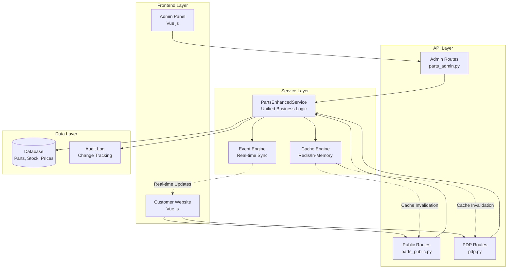

# Database-Service Alignment Design Document

## Overview

This design document outlines the architecture for ensuring consistent data synchronization between the Admin Panel and Customer Website, focusing on stock management and product content management. The analysis reveals that the current system has a solid foundation but requires enhancements to achieve real-time synchronization and prevent race conditions.

## Architecture

### Current State Analysis

**Database Models:**
- **Core Models**: `Part`, `Price`, `StockLevel`, `PartPrice`, `PartImage`, `PartSpecification`
- **Stock Management**: Dedicated `StockLevel` model with `current_stock`, `reserved_quantity`, `min_stock_level`
- **Pricing**: Dual pricing system with legacy `Price` model and new `PartPrice` model
- **Content**: Rich content support with `PartImage`, `PartSpecification`, categories

**API Structure:**
- **Admin APIs**: `parts_admin.py` - Full CRUD with authentication
- **Public APIs**: `parts_public.py` - Read-only customer access
- **PDP APIs**: `pdp.py` - Comprehensive product detail page support
- **Unified Service**: `PartsEnhancedService` - Single service layer for both interfaces

**Frontend Structure:**
- **Admin Panel**: Vue.js application (`app/frontend/panel/`)
- **Customer Website**: Vue.js application (`app/frontend/web/`)
- **Separate Builds**: Independent deployment and caching strategies

### Target Architecture



## Components and Interfaces

### 1. Enhanced Service Layer

**PartsEnhancedService Extensions:**
```python
class PartsEnhancedService:
    def __init__(self, db: Session, cache_manager: CacheManager, event_publisher: EventPublisher):
        self.db = db
        self.cache_manager = cache_manager
        self.event_publisher = event_publisher
    
    @transactional
    @cache_invalidate(["parts", "stock", "prices"])
    @publish_event("stock.updated")
    def update_stock_with_sync(self, part_id: int, stock_data: Dict) -> StockLevel:
        # Atomic stock update with real-time sync
        pass
    
    @transactional
    @cache_invalidate(["parts", "content"])
    @publish_event("content.updated")
    def update_part_content_with_sync(self, part_id: int, content_data: Dict) -> Part:
        # Atomic content update with real-time sync
        pass
```

### 2. Cache Management System

**Cache Strategy:**
```python
class CacheManager:
    def __init__(self, redis_client: Redis):
        self.redis = redis_client
        self.local_cache = {}
    
    def invalidate_part_cache(self, part_id: int):
        # Invalidate all cache entries related to a part
        keys_to_invalidate = [
            f"part:{part_id}",
            f"part:{part_id}:stock",
            f"part:{part_id}:prices",
            f"part:{part_id}:images",
            f"part:{part_id}:specs",
            "parts:list:*",  # Invalidate list caches
            "pdp:*"  # Invalidate PDP caches
        ]
        self.redis.delete(*keys_to_invalidate)
    
    def get_or_set_part_data(self, part_id: int, fetch_func: Callable):
        # Cache-aside pattern with TTL
        pass
```

### 3. Real-time Event System

**Event Publisher:**
```python
class EventPublisher:
    def __init__(self, websocket_manager: WebSocketManager):
        self.websocket_manager = websocket_manager
    
    def publish_stock_update(self, part_id: int, stock_data: Dict):
        event = {
            "type": "stock.updated",
            "part_id": part_id,
            "data": stock_data,
            "timestamp": datetime.utcnow().isoformat()
        }
        # Broadcast to connected customer websites
        self.websocket_manager.broadcast_to_customers(event)
    
    def publish_content_update(self, part_id: int, content_data: Dict):
        event = {
            "type": "content.updated",
            "part_id": part_id,
            "data": content_data,
            "timestamp": datetime.utcnow().isoformat()
        }
        self.websocket_manager.broadcast_to_customers(event)
```

### 4. Database Consistency Layer

**Transaction Management:**
```python
class TransactionManager:
    def __init__(self, db: Session):
        self.db = db
    
    @contextmanager
    def atomic_operation(self):
        try:
            self.db.begin()
            yield self.db
            self.db.commit()
        except Exception as e:
            self.db.rollback()
            raise DatabaseConsistencyError(f"Transaction failed: {e}")
    
    def with_row_locking(self, model_class, record_id: int):
        # Implement row-level locking for concurrent updates
        return self.db.query(model_class).filter(
            model_class.id == record_id
        ).with_for_update().first()
```

### 5. API Synchronization Layer

**Enhanced Admin API:**
```python
@router.put("/{part_id}/stock")
async def update_part_stock_with_sync(
    part_id: int,
    request: StockLevelIn,
    db: Session = Depends(get_db),
    current_user: User = Depends(get_current_admin_user)
):
    try:
        parts_service = PartsEnhancedService(db, cache_manager, event_publisher)
        
        # Atomic update with real-time sync
        stock = parts_service.update_stock_with_sync(
            part_id, 
            request.dict(exclude_unset=True),
            user_id=current_user.id
        )
        
        return StockLevelOut.from_orm(stock)
    except ConcurrencyError as e:
        raise HTTPException(status_code=409, detail="Concurrent modification detected")
    except Exception as e:
        raise HTTPException(status_code=500, detail="Stock update failed")
```

**Enhanced Public API:**
```python
@router.get("/{part_id}")
@cache_response(ttl=300)  # 5-minute cache
async def get_part_detail_with_real_time(
    part_id: int, 
    db: Session = Depends(get_db)
):
    try:
        parts_service = PartsEnhancedService(db, cache_manager, event_publisher)
        part = parts_service.get_part_with_real_time_data(part_id)
        
        if not part:
            raise HTTPException(status_code=404, detail="Part not found")
        
        return _serialize_part_detail(part)
    except Exception as e:
        raise HTTPException(status_code=500, detail="Failed to fetch part details")
```

## Data Models

### Enhanced Stock Model

```python
class StockLevel(Base):
    __tablename__ = "stock_levels"
    
    id = Column(Integer, primary_key=True, index=True)
    part_id = Column(Integer, ForeignKey("parts.id"), nullable=False, unique=True)
    current_stock = Column(Integer, nullable=False, default=0)
    reserved_quantity = Column(Integer, nullable=False, default=0)
    min_stock_level = Column(Integer, nullable=False, default=0)
    
    # Concurrency control
    version = Column(Integer, nullable=False, default=1)  # Optimistic locking
    last_updated_by = Column(Integer, ForeignKey("users.id"), nullable=True)
    
    # Timestamps
    created_at = Column(DateTime, default=func.now(), nullable=False)
    updated_at = Column(DateTime, default=func.now(), onupdate=func.now(), nullable=False)
    
    # Computed properties
    @property
    def available_stock(self) -> int:
        return max(0, self.current_stock - self.reserved_quantity)
    
    @property
    def is_in_stock(self) -> bool:
        return self.available_stock > 0
    
    @property
    def is_low_stock(self) -> bool:
        return self.available_stock <= self.min_stock_level
```

### Content Version Control

```python
class PartContentVersion(Base):
    __tablename__ = "part_content_versions"
    
    id = Column(Integer, primary_key=True, index=True)
    part_id = Column(Integer, ForeignKey("parts.id"), nullable=False)
    version_number = Column(Integer, nullable=False)
    content_snapshot = Column(JSON, nullable=False)  # Full content snapshot
    change_summary = Column(Text, nullable=True)
    created_by = Column(Integer, ForeignKey("users.id"), nullable=False)
    created_at = Column(DateTime, default=func.now(), nullable=False)
    is_active = Column(Boolean, default=True, nullable=False)
    
    # Relationships
    part = relationship("Part", backref="content_versions")
    created_by_user = relationship("User")
```

### Audit Trail

```python
class DataChangeLog(Base):
    __tablename__ = "data_change_logs"
    
    id = Column(Integer, primary_key=True, index=True)
    table_name = Column(String(100), nullable=False, index=True)
    record_id = Column(Integer, nullable=False, index=True)
    operation = Column(String(20), nullable=False)  # INSERT, UPDATE, DELETE
    old_values = Column(JSON, nullable=True)
    new_values = Column(JSON, nullable=True)
    changed_by = Column(Integer, ForeignKey("users.id"), nullable=True)
    changed_at = Column(DateTime, default=func.now(), nullable=False)
    ip_address = Column(String(45), nullable=True)
    user_agent = Column(Text, nullable=True)
```

## Error Handling

### Concurrency Control

```python
class ConcurrencyError(Exception):
    """Raised when concurrent modifications are detected."""
    pass

class OptimisticLockingMixin:
    def update_with_version_check(self, db: Session, **kwargs):
        current_version = self.version
        self.version += 1
        
        # Update with version check
        result = db.query(self.__class__).filter(
            self.__class__.id == self.id,
            self.__class__.version == current_version
        ).update({**kwargs, 'version': self.version})
        
        if result == 0:
            raise ConcurrencyError("Record was modified by another user")
        
        db.commit()
        return self
```

### Cache Consistency

```python
class CacheConsistencyManager:
    def __init__(self, cache_manager: CacheManager):
        self.cache_manager = cache_manager
        self.retry_queue = []
    
    def ensure_cache_consistency(self, operation: str, part_id: int):
        try:
            self.cache_manager.invalidate_part_cache(part_id)
        except Exception as e:
            # Add to retry queue for eventual consistency
            self.retry_queue.append({
                'operation': operation,
                'part_id': part_id,
                'timestamp': datetime.utcnow(),
                'retry_count': 0
            })
            logger.error(f"Cache invalidation failed for part {part_id}: {e}")
    
    async def process_retry_queue(self):
        # Background task to ensure eventual consistency
        for item in self.retry_queue[:]:
            try:
                self.cache_manager.invalidate_part_cache(item['part_id'])
                self.retry_queue.remove(item)
            except Exception as e:
                item['retry_count'] += 1
                if item['retry_count'] > 3:
                    self.retry_queue.remove(item)
                    logger.error(f"Cache consistency failed permanently for part {item['part_id']}")
```

## Testing Strategy

### Integration Tests

```python
class TestDatabaseServiceAlignment:
    def test_admin_stock_update_reflects_in_customer_view(self):
        # Admin updates stock
        admin_response = self.admin_client.put(
            f"/api/v1/admin/parts/{part_id}/stock",
            json={"current_stock": 50}
        )
        assert admin_response.status_code == 200
        
        # Customer view should reflect immediately
        customer_response = self.customer_client.get(f"/api/v1/parts/{part_id}")
        assert customer_response.json()["stock"]["current_stock"] == 50
    
    def test_concurrent_stock_updates_prevent_race_conditions(self):
        # Simulate concurrent updates
        with ThreadPoolExecutor(max_workers=5) as executor:
            futures = [
                executor.submit(self.update_stock, part_id, 10)
                for _ in range(5)
            ]
            results = [f.result() for f in futures]
        
        # Only one should succeed, others should get 409 Conflict
        success_count = sum(1 for r in results if r.status_code == 200)
        conflict_count = sum(1 for r in results if r.status_code == 409)
        
        assert success_count == 1
        assert conflict_count == 4
    
    def test_cache_invalidation_on_content_update(self):
        # Cache part data
        response1 = self.customer_client.get(f"/api/v1/parts/{part_id}")
        etag1 = response1.headers.get("etag")
        
        # Admin updates content
        self.admin_client.put(
            f"/api/v1/admin/parts/{part_id}",
            json={"part_name": "Updated Part Name"}
        )
        
        # Customer should get updated data (cache invalidated)
        response2 = self.customer_client.get(f"/api/v1/parts/{part_id}")
        etag2 = response2.headers.get("etag")
        
        assert etag1 != etag2
        assert response2.json()["part_name"] == "Updated Part Name"
```

### Performance Tests

```python
class TestPerformanceAlignment:
    def test_admin_update_latency_under_1_second(self):
        start_time = time.time()
        
        response = self.admin_client.put(
            f"/api/v1/admin/parts/{part_id}/stock",
            json={"current_stock": 100}
        )
        
        end_time = time.time()
        latency = end_time - start_time
        
        assert response.status_code == 200
        assert latency < 1.0  # Under 1 second
    
    def test_customer_view_reflects_changes_within_1_second(self):
        # Admin update
        admin_update_time = time.time()
        self.admin_client.put(
            f"/api/v1/admin/parts/{part_id}/stock",
            json={"current_stock": 75}
        )
        
        # Customer view
        max_wait_time = 1.0
        start_wait = time.time()
        
        while time.time() - start_wait < max_wait_time:
            response = self.customer_client.get(f"/api/v1/parts/{part_id}")
            if response.json()["stock"]["current_stock"] == 75:
                sync_time = time.time() - admin_update_time
                assert sync_time < 1.0
                return
            time.sleep(0.1)
        
        assert False, "Customer view did not sync within 1 second"
```

## Deployment Considerations

### Database Migrations

```sql
-- Add version control for optimistic locking
ALTER TABLE stock_levels ADD COLUMN version INTEGER NOT NULL DEFAULT 1;
ALTER TABLE parts ADD COLUMN version INTEGER NOT NULL DEFAULT 1;

-- Add audit trail tables
CREATE TABLE data_change_logs (
    id SERIAL PRIMARY KEY,
    table_name VARCHAR(100) NOT NULL,
    record_id INTEGER NOT NULL,
    operation VARCHAR(20) NOT NULL,
    old_values JSONB,
    new_values JSONB,
    changed_by INTEGER REFERENCES users(id),
    changed_at TIMESTAMP DEFAULT NOW(),
    ip_address VARCHAR(45),
    user_agent TEXT
);

CREATE INDEX idx_data_change_logs_table_record ON data_change_logs(table_name, record_id);
CREATE INDEX idx_data_change_logs_changed_at ON data_change_logs(changed_at);

-- Add content versioning
CREATE TABLE part_content_versions (
    id SERIAL PRIMARY KEY,
    part_id INTEGER NOT NULL REFERENCES parts(id),
    version_number INTEGER NOT NULL,
    content_snapshot JSONB NOT NULL,
    change_summary TEXT,
    created_by INTEGER NOT NULL REFERENCES users(id),
    created_at TIMESTAMP DEFAULT NOW(),
    is_active BOOLEAN DEFAULT TRUE
);

CREATE INDEX idx_part_content_versions_part_id ON part_content_versions(part_id);
CREATE INDEX idx_part_content_versions_active ON part_content_versions(part_id, is_active);
```

### Monitoring and Alerting

```python
class SyncMonitoring:
    def __init__(self, metrics_client):
        self.metrics = metrics_client
    
    def record_sync_latency(self, operation: str, latency_ms: float):
        self.metrics.histogram(
            "database_sync_latency_ms",
            latency_ms,
            tags={"operation": operation}
        )
    
    def record_cache_hit_rate(self, cache_type: str, hit_rate: float):
        self.metrics.gauge(
            "cache_hit_rate",
            hit_rate,
            tags={"cache_type": cache_type}
        )
    
    def alert_sync_failure(self, operation: str, error: str):
        self.metrics.increment(
            "sync_failures_total",
            tags={"operation": operation, "error_type": type(error).__name__}
        )
```

This design ensures that the Admin Panel and Customer Website maintain perfect synchronization while providing the performance, consistency, and reliability required for a production e-commerce system.