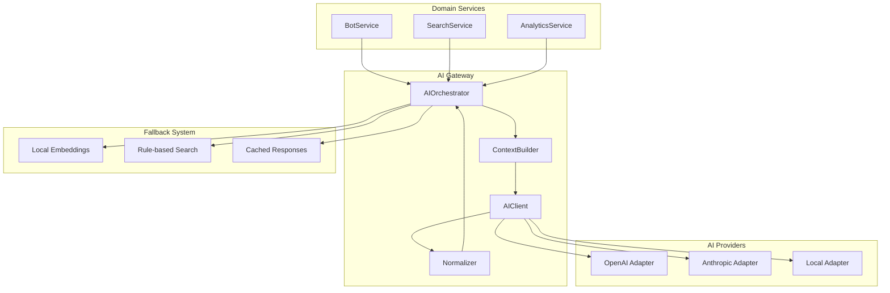
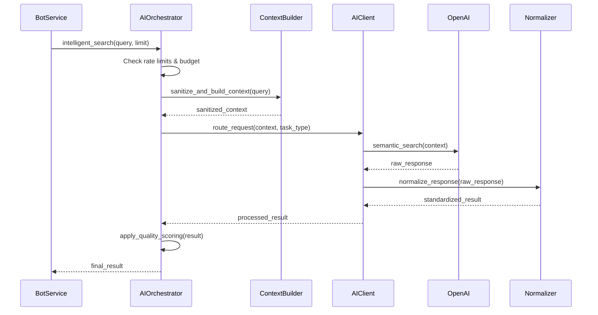
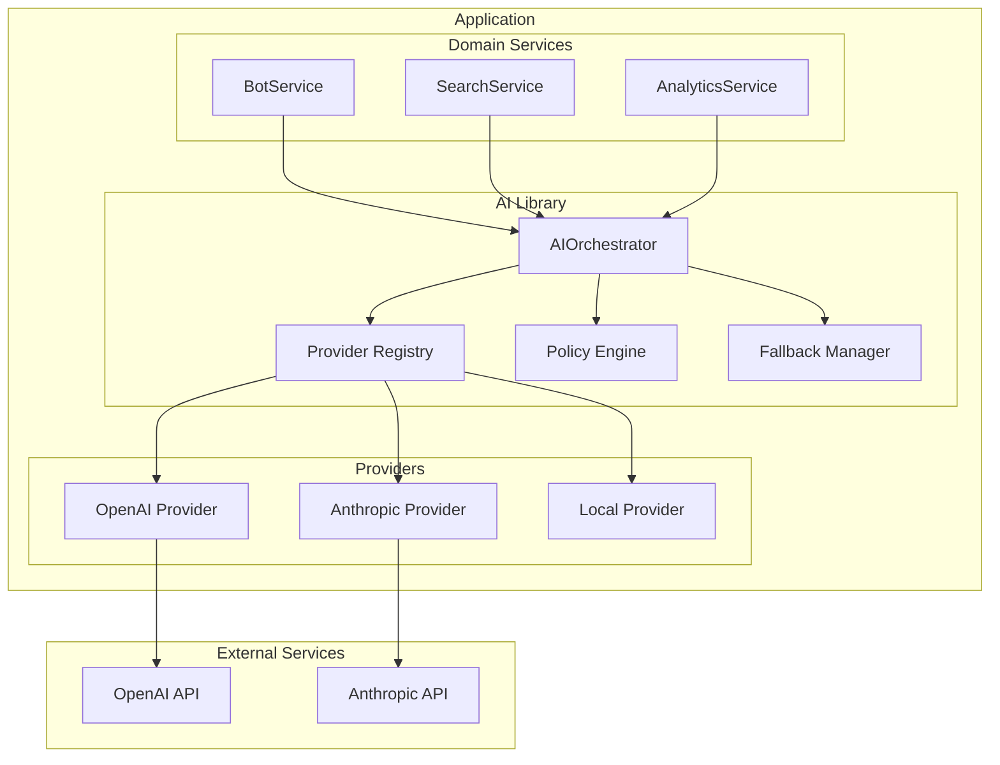
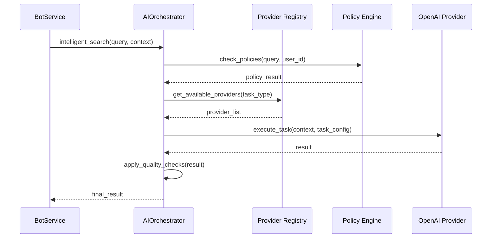
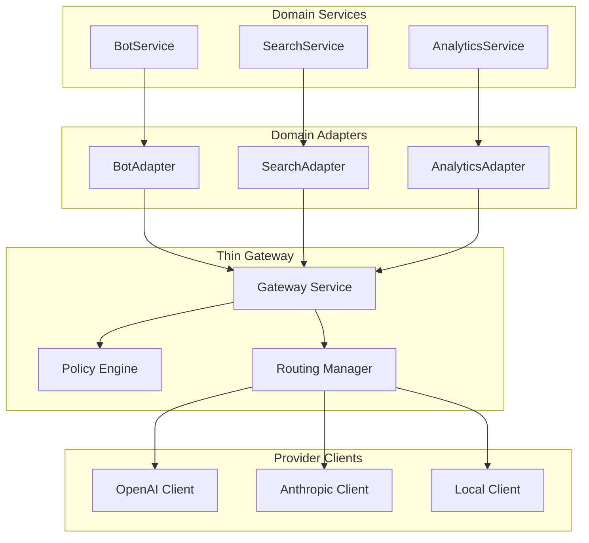
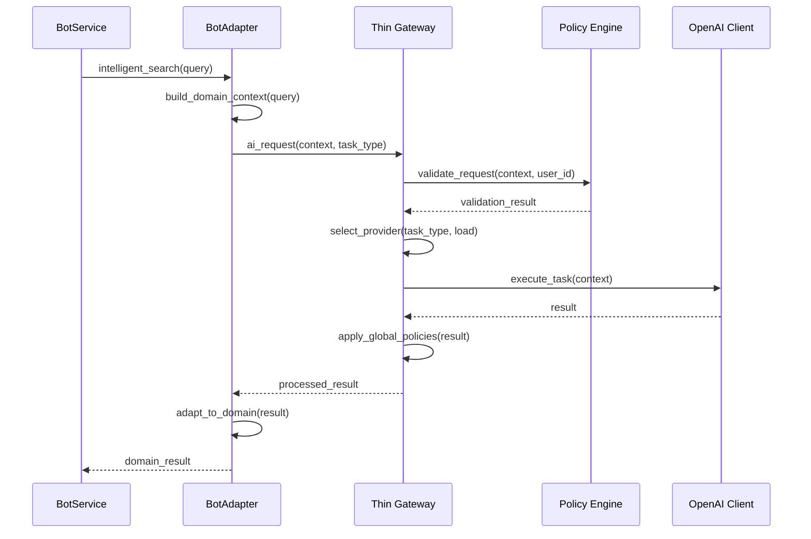

# AI Architecture Options

## 1. Overview

The China Car Parts system requires a robust AI management framework to control traffic, manage context, provide local fallback, and support multiple AI providers while maintaining existing public APIs. The current implementation has AI services embedded directly in domain services, creating tight coupling and limited control over AI usage, costs, and quality.

**Non-goals**: No domain logic merge; preserve existing public APIs; maintain backward compatibility; avoid breaking changes to current search functionality.

## 2. Option A — Central AI Gateway (Single Module/Service)

### Components
- **AIProvider Adapters**: OpenAI, Anthropic, Local processing adapters
- **AIClient**: Unified client interface for all providers
- **AIOrchestrator**: Routing, policy enforcement, load balancing
- **ContextBuilder**: PII sanitization, prompt construction, context management
- **Normalizer**: Response standardization, quality scoring, validation
- **Fallbacks**: Local embeddings, rule-based search, cached responses

### Architecture Diagram

### Sequence Diagram: Intelligent Search

### Pros
- **Single choke point** for all AI traffic control
- **Centralized policy enforcement** (rate limiting, budget, PII)
- **Unified monitoring** and observability
- **Easy provider switching** and load balancing
- **Consistent error handling** and fallback logic

### Cons
- **Single point of failure** if gateway fails
- **Potential performance bottleneck** under high load
- **Tight coupling** between gateway and domain services
- **Complex deployment** and scaling requirements

### Rollout Path
1. Deploy gateway alongside existing AI service
2. Add feature flag to route through gateway
3. Gradually migrate domain services to use gateway
4. Remove old AI service after full migration

### Backout Plan
- Feature flag to disable gateway routing
- Fallback to existing AI service implementation
- Database rollback for configuration changes

## 3. Option B — Embedded Library + Provider Registry (In-App)

### Components
- **AIOrchestrator Library**: Internal library with provider registry
- **Provider Registry**: Dynamic provider registration and discovery
- **Context Adapters**: Domain-specific context building
- **Policy Engine**: Embedded policy enforcement
- **Fallback Manager**: Local processing coordination

### Architecture Diagram

### Sequence Diagram: Intelligent Search

### Pros
- **Simple deployment** - no additional services
- **Low latency** - no network overhead
- **Easy testing** - library can be mocked
- **Flexible integration** - domain services control usage

### Cons
- **Tight coupling** with application code
- **Limited scalability** - constrained by app resources
- **Harder to monitor** - mixed with application logs
- **Provider management** complexity in code

### Rollout Path
1. Create AI library with orchestrator
2. Register providers in application startup
3. Update domain services to use orchestrator
4. Add policy configuration to database

### Backout Plan
- Revert domain service changes
- Remove AI library imports
- Restore original AI service calls

## 4. Option C — Hybrid (Thin Gateway + Domain Adapters)

### Components
- **Thin Gateway**: Policy enforcement, routing, monitoring
- **Domain Adapters**: Search, Bot, Analytics adapters
- **Provider Clients**: Direct provider communication
- **Shared Library**: Common utilities and fallbacks

### Architecture Diagram

### Sequence Diagram: Intelligent Search

### Pros
- **Domain-specific context** handling
- **Lighter gateway** - less complex
- **Better separation** of concerns
- **Easier testing** of domain logic

### Cons
- **More components** to manage
- **Complex routing** between gateway and adapters
- **Potential inconsistency** across adapters
- **Harder to enforce** global policies

### Rollout Path
1. Deploy thin gateway service
2. Create domain adapters
3. Update domain services to use adapters
4. Configure routing and policies

### Backout Plan
- Disable gateway routing
- Revert to direct provider calls
- Remove adapter layer

## 5. Cross-cutting Concerns (Compare Across Options)

### Multi-Provider Routing
- **Option A**: Centralized routing with load balancing
- **Option B**: Registry-based provider selection
- **Option C**: Gateway-managed routing with domain preferences

### Local Fallback Hierarchy
1. **AI → AI' → Local Embeddings → Heuristic → Basic Search**
2. **Option A**: Centralized fallback management
3. **Option B**: Library-managed fallback chain
4. **Option C**: Gateway + adapter fallback coordination

### Observability
- **Option A**: Centralized logging, metrics, traces
- **Option B**: Distributed logging with correlation IDs
- **Option C**: Gateway metrics + domain-specific logs

### Budget/Rate/Timeouts/Circuit Breaker
- **Option A**: All controls in gateway
- **Option B**: Policy engine in library
- **Option C**: Gateway policies + adapter enforcement

### Privacy & PII Redaction
- **Option A**: Centralized sanitization
- **Option B**: Library-based sanitization
- **Option C**: Gateway + adapter sanitization

### Config Surfaces
- **Option A**: Gateway configuration + database settings
- **Option B**: Application configuration + database
- **Option C**: Gateway config + adapter configs

### Testability
- **Option A**: Mock gateway for testing
- **Option B**: Mock library components
- **Option C**: Mock gateway + adapters

### Resilience
- **Option A**: Single point of failure risk
- **Option B**: Application-level resilience
- **Option C**: Distributed resilience

## 6. Recommendation (Non-binding)

**Tentative Choice: Option A — Central AI Gateway**

### Rationale
1. **Policy Control**: Centralized enforcement aligns with vision requirements
2. **Observability**: Single point for monitoring and alerting
3. **Provider Management**: Easy to add/remove providers
4. **Cost Control**: Centralized budget and rate limiting
5. **Security**: Centralized PII handling and audit logging

### Trade-offs
- **Complexity**: More complex deployment and operations
- **Performance**: Additional network hop adds latency
- **Reliability**: Single point of failure requires high availability
- **Development**: More upfront work to build gateway

### Assumptions
- Team can manage additional service complexity
- Network latency is acceptable (< 50ms overhead)
- High availability requirements can be met
- Budget allows for gateway infrastructure

## 7. Migration Plan (Minimal, Non-breaking)

### Phase 1: Foundation (Week 1-2)
1. Deploy AI Gateway alongside existing service
2. Add feature flag `AI_GATEWAY_ENABLED` to settings
3. Create basic provider adapters (OpenAI, Local)
4. Implement policy engine with rate limiting

### Phase 2: Integration (Week 3-4)
1. Update SearchService to use gateway (feature-flagged)
2. Update BotService to use gateway (feature-flagged)
3. Add monitoring and logging
4. Test fallback mechanisms

### Phase 3: Migration (Week 5-6)
1. Enable gateway for 10% of traffic
2. Monitor performance and errors
3. Gradually increase to 100% traffic
4. Remove old AI service code

### Limited Call-sites to Rewire First
1. **SearchService.search_parts()** - Most critical path
2. **BotService.search_and_confirm_part()** - User-facing
3. **AnalyticsService.generate_insights()** - Low volume

### Smoke Test Criteria
- AI search returns results within 2 seconds
- Fallback works when AI providers fail
- Rate limiting prevents abuse
- Cost tracking shows accurate usage

### Stop Criteria
- 99.9% uptime for gateway
- < 100ms additional latency
- Zero data loss during migration
- All existing tests pass

## 8. Open Questions

1. **Operational Constraints**: What is the team's capacity to manage an additional service (AI Gateway), and are there infrastructure limitations that would favor the embedded library approach?

2. **Team Ownership**: Who will be responsible for maintaining the AI Gateway service, and does the team have experience with microservice architecture and service mesh patterns?

3. **Infrastructure Limits**: What are the current infrastructure constraints (CPU, memory, network) that might impact the choice between a separate gateway service vs. embedded library?

4. **Expected Traffic**: What is the projected AI request volume (requests per second, peak concurrent users), and how does this impact the choice between centralized vs. distributed AI management?

5. **Provider Roadmap**: Are there plans to integrate additional AI providers beyond OpenAI and Anthropic, and how does this affect the provider management complexity in each option?

6. **Monitoring and Alerting**: What level of AI service monitoring is required, and does the team have existing monitoring infrastructure that would favor one approach over another?
