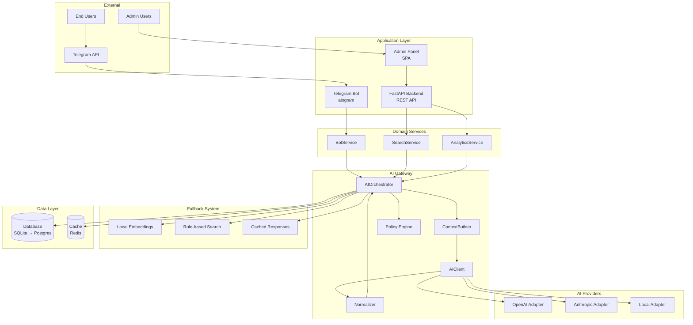
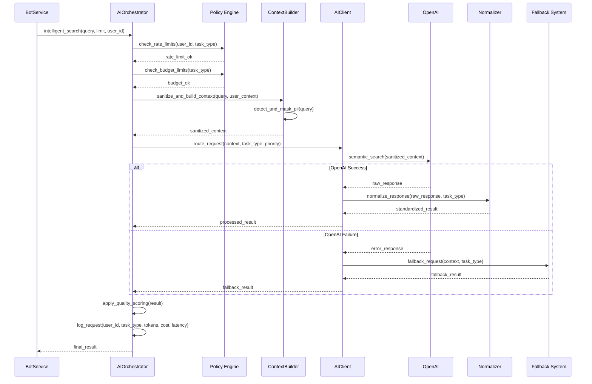

# RFC: Target Architecture for AI Gateway/Orchestrator

## 1. Decision Summary

**Chosen Option: Option A — Central AI Gateway**

### Rationale
The Central AI Gateway best aligns with our strategic goals of controlled traffic, context management, and multi-provider support while maintaining domain logic separation. This approach provides centralized policy enforcement, unified monitoring, and consistent fallback mechanisms.

### What Stays the Same
- **Public APIs**: All existing REST endpoints remain unchanged
- **Bot UX**: Telegram bot user experience is preserved
- **Domain Services**: BotService, SearchService, AnalyticsService interfaces unchanged
- **Admin Panel**: Existing AI toggle functionality maintained

### Scope
- Centralized AI request routing and policy enforcement
- Multi-provider support (OpenAI, Anthropic, Local)
- PII sanitization and context management
- Comprehensive observability and cost control
- Graceful fallback to local processing

### Non-Goals
- No domain logic merge into gateway
- No breaking changes to existing APIs
- No changes to user-facing interfaces
- No migration of existing data structures

## 2. Architecture Snapshot

### Container Diagram

### Sequence Diagram: Intelligent Search

## 3. Interfaces (Indicative, Non-binding)

### AIProvider Interface
**Responsibility**: Abstract interface for all AI providers
**Inputs**: Sanitized context, task configuration, timeout settings
**Outputs**: Standardized response format, metadata (tokens, cost, latency)
**Key Methods**:
- `execute_task(context, config) -> AIResponse`
- `is_available() -> bool`
- `get_capabilities() -> List[TaskType]`

### AIClient Interface
**Responsibility**: Unified client for provider communication
**Inputs**: Task request, provider selection criteria
**Outputs**: Provider response with error handling
**Key Methods**:
- `route_request(request, criteria) -> AIResponse`
- `get_provider_status() -> Dict[Provider, Status]`
- `handle_fallback(request) -> AIResponse`

### AIOrchestrator Interface
**Responsibility**: Central coordination and policy enforcement
**Inputs**: Domain service requests, user context, task parameters
**Outputs**: Processed AI responses with metadata
**Key Methods**:
- `intelligent_search(query, limit, user_id) -> SearchResult`
- `semantic_search(context, limit) -> List[Part]`
- `analyze_query(query) -> QueryAnalysis`
- `generate_suggestions(context, results) -> List[str]`

### Policy Enforcement Points
- **Rate Limiting**: AIOrchestrator checks user/IP limits before processing
- **Budget Control**: Policy Engine validates cost limits per request
- **PII Redaction**: ContextBuilder sanitizes all outgoing data
- **Response Validation**: Normalizer validates and filters incoming responses

## 4. Config & Policies

### Configuration Surfaces
- **Environment Variables**: Provider API keys, default timeouts, feature flags
- **Database Settings**: Runtime toggles, rate limits, budget caps, model preferences
- **Admin Panel UI**: Real-time policy adjustments, provider weights, fallback order

### Policy Hooks
- **Rate Limits**: Per-user, per-IP, per-task-type with burst allowances
- **Timeouts**: Primary (5s), Secondary (3s), Fallback (1s) with retry logic
- **Retries**: Exponential backoff with jitter, circuit breaker patterns
- **Budgets**: Daily/monthly caps with alerting and auto-shutdown
- **Model Allowlist**: Approved models per provider with cost tracking
- **Routing Weights**: Load balancing between providers based on performance
- **Fallback Order**: AI → AI' → Local Embeddings → Rule-based → Basic Search

### Hot-Reload Expectations
- **Settings Changes**: Immediate effect for rate limits, timeouts, routing weights
- **Provider Toggle**: 30-second grace period for in-flight requests
- **Budget Alerts**: Real-time monitoring with immediate enforcement
- **Model Changes**: Requires service restart for new model integrations

## 5. Observability & Control

### Logging (Masked Prompts)
- **Request Logs**: User ID, task type, provider, tokens used, cost, latency
- **Error Logs**: Provider failures, fallback triggers, policy violations
- **Audit Logs**: PII redaction events, policy changes, admin actions
- **Masked Prompts**: PII-replaced context for debugging without exposure

### Metrics
- **Performance**: P95 latency, throughput, error rate by provider
- **Cost**: Token usage, cost per request, daily/monthly spend
- **Quality**: Response relevance scores, fallback usage rates
- **Reliability**: Uptime, circuit breaker trips, retry success rates

### Traces
- **Request ID**: End-to-end correlation across all components
- **Provider Chain**: Primary → Secondary → Fallback routing decisions
- **Timing**: Breakdown of processing time per component
- **Context Flow**: Data transformation through sanitization and normalization

### Admin Panel Needs (MVP)
- **Read-Only Dashboard**: Real-time metrics, cost tracking, error monitoring
- **Policy View**: Current rate limits, budget status, provider health
- **Log Viewer**: Filtered, searchable logs with PII masking
- **Alert Management**: Configure thresholds and notification channels

## 6. Migration & Backout

### Minimal Non-Breaking Steps
1. **Deploy Gateway**: Deploy AI Gateway service alongside existing AI service
2. **Feature Flag**: Add `AI_GATEWAY_ENABLED` setting to database
3. **Provider Adapters**: Create OpenAI and Local provider adapters
4. **Policy Engine**: Implement basic rate limiting and budget controls
5. **Gradual Migration**: Route 10% → 50% → 100% of traffic through gateway

### Limited Call-Sites to Rewire First
1. **SearchService.search_parts()** - Most critical user-facing path
2. **BotService.search_and_confirm_part()** - Telegram bot integration
3. **AnalyticsService.generate_insights()** - Low-volume, safe for testing

### Backout Plan
- **Immediate**: Disable `AI_GATEWAY_ENABLED` flag to route through existing AI service
- **Code Rollback**: Revert domain service changes to use original AI service calls
- **Data Rollback**: Restore previous settings from database backup
- **Recovery Time**: < 5 minutes to restore previous functionality

## 7. Risks & Mitigations

### Performance Overhead
- **Risk**: Additional network hop adds latency
- **Target**: ≤ 50ms overhead for gateway processing
- **Mitigation**: Optimize serialization, use connection pooling, implement caching

### Single Point of Failure
- **Risk**: Gateway failure affects all AI functionality
- **Mitigation**: High availability deployment, circuit breaker to local fallback, health checks

### Cost Control
- **Risk**: Uncontrolled AI API usage and costs
- **Mitigation**: Hard budget caps, real-time cost tracking, auto-shutdown at limits

### Data Privacy
- **Risk**: PII exposure to external AI providers
- **Mitigation**: Comprehensive PII detection and masking, audit logging, data retention policies

## 8. KPIs & Acceptance Criteria

### Performance Targets
- **Gateway P95 Latency**: ≤ 50ms overhead over direct provider calls
- **Error Rate**: ≤ 1% for gateway processing
- **Fallback Success Rate**: ≥ 99% when AI providers fail
- **Budget Accuracy**: ±5% cost tracking accuracy

### Smoke Test Checklist
- [ ] Gateway responds to health checks
- [ ] Rate limiting prevents abuse
- [ ] PII masking works correctly
- [ ] Fallback triggers on provider failure
- [ ] Cost tracking shows accurate usage
- [ ] Admin panel displays real-time metrics
- [ ] Feature flag enables/disables gateway routing

## 9. Approval Checklist

### Product Approval
- [ ] User experience remains unchanged
- [ ] Admin controls meet requirements
- [ ] Cost controls are sufficient
- [ ] Performance targets are acceptable

### Platform Approval
- [ ] Architecture supports scalability needs
- [ ] Monitoring and alerting requirements met
- [ ] Security and privacy controls adequate
- [ ] Integration points are well-defined

### Infrastructure Approval
- [ ] Resource requirements are reasonable
- [ ] High availability plan is feasible
- [ ] Deployment strategy is sound
- [ ] Backup and recovery procedures defined

### Assumptions
- Team can manage additional service complexity
- Network latency overhead is acceptable
- Budget allows for gateway infrastructure
- Existing monitoring tools can be extended

## 10. Open Questions (Final)

1. **Infrastructure Capacity**: What are the current server resources (CPU, memory, network) available for the AI Gateway service, and do we need to provision additional infrastructure?

2. **Provider Integration Timeline**: When will the Anthropic API integration be completed, and should we proceed with OpenAI-only implementation initially?

3. **Budget Allocation**: What is the monthly budget allocation between different AI providers, and should we implement per-user or per-tenant budget limits?

4. **Monitoring Integration**: Which existing monitoring tools (Prometheus, Grafana, etc.) should the AI Gateway integrate with, and who will maintain the monitoring dashboards?

5. **Security Review**: What level of security review is required for the PII sanitization and data handling components, and are there specific compliance requirements to meet?
