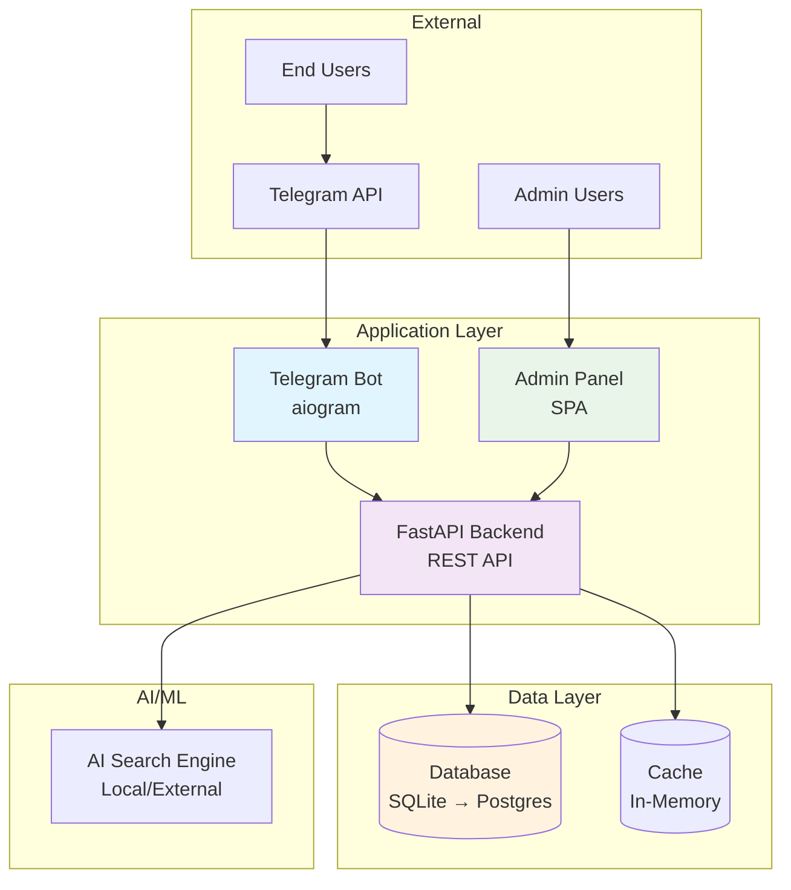
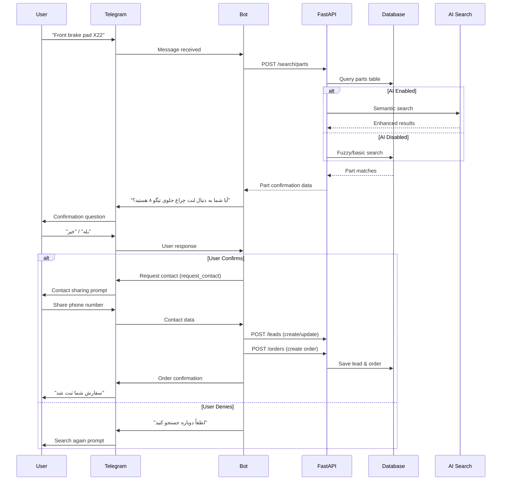
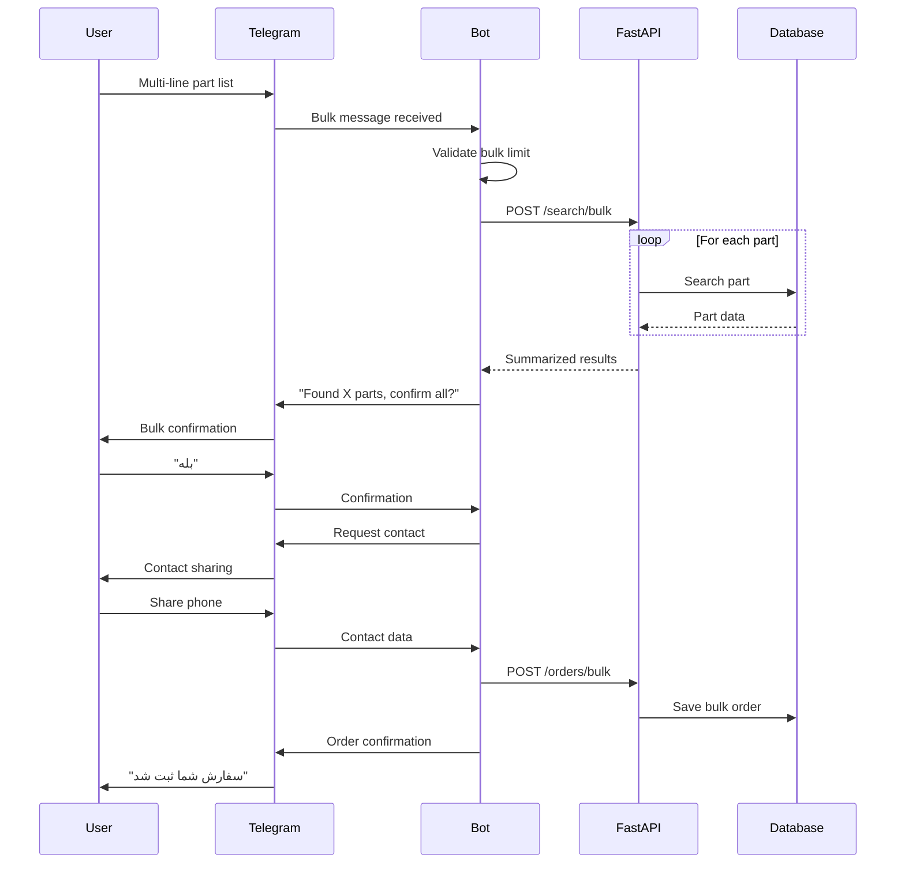
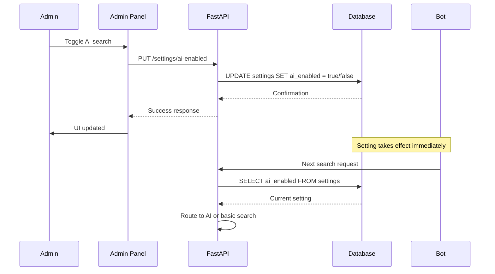
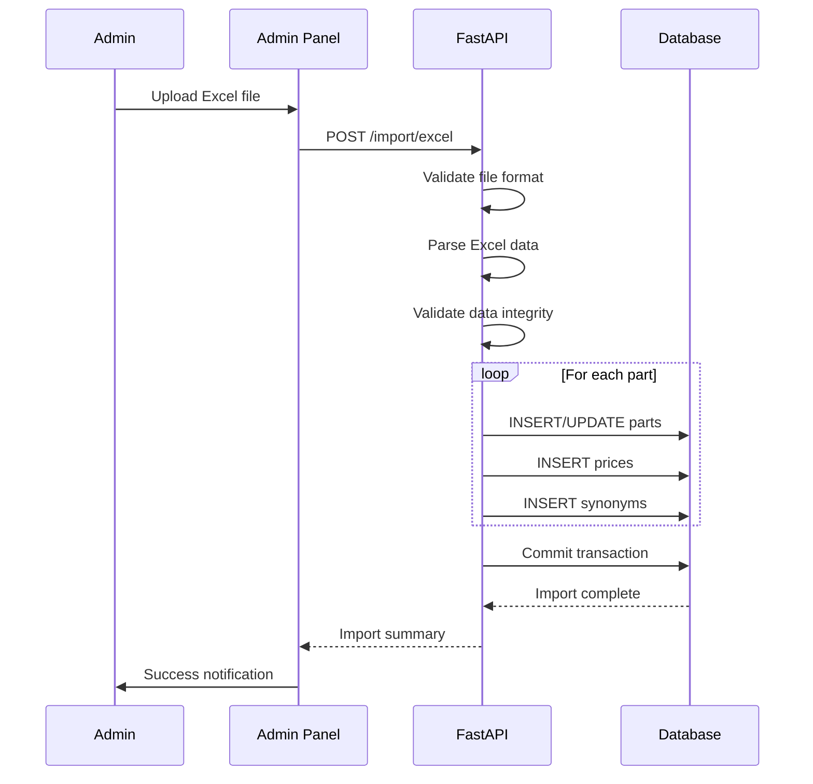
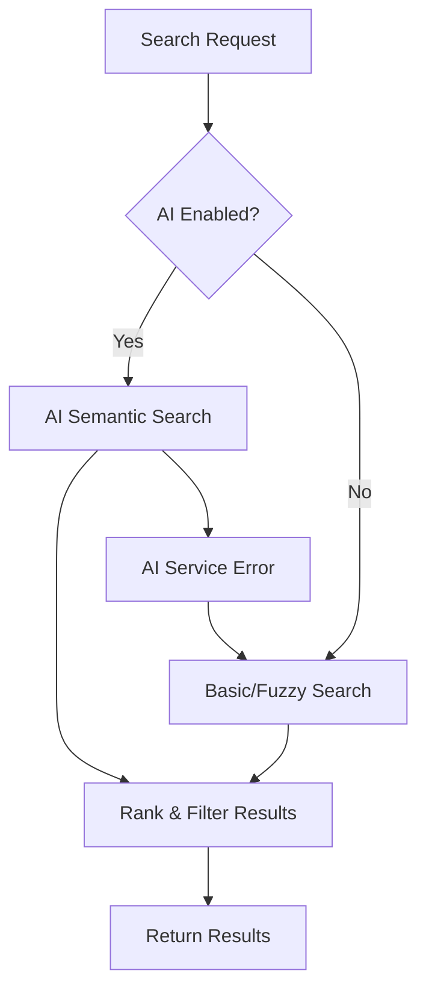
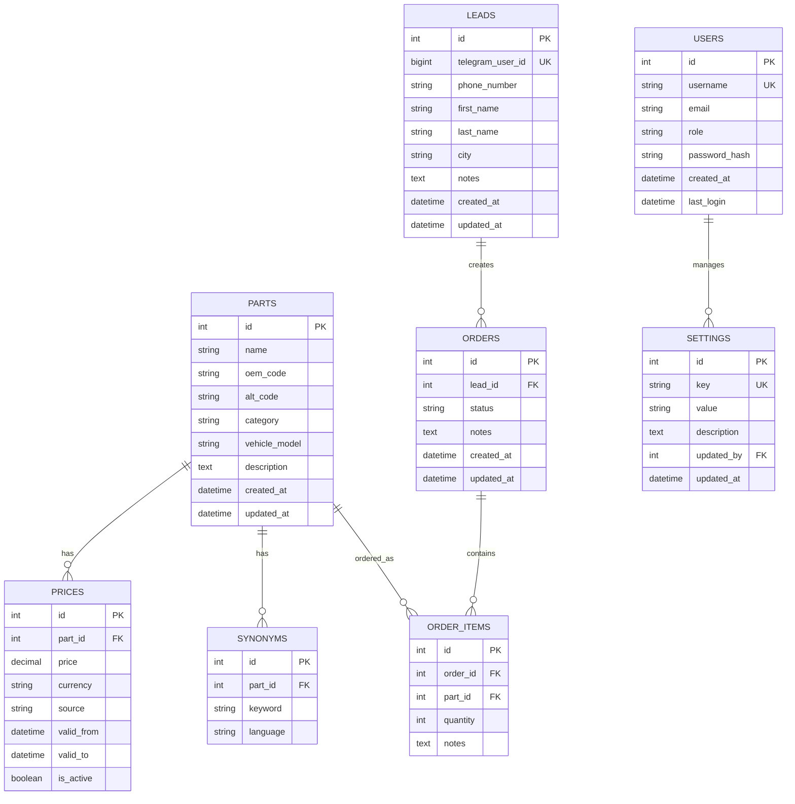

# Chinese Auto Parts Price Bot - Architecture Documentation

## 1. Overview

The Chinese Auto Parts Price Bot is a Telegram-based price lookup system that enables users to search for Chinese car parts, receive part confirmations in Persian, and submit formal orders through a streamlined contact capture workflow. The system consists of a Telegram bot frontend, FastAPI backend, SQLite database, and admin panel, with AI-powered semantic search capabilities that can be toggled on/off by administrators.

### Major Components
- **Telegram Bot (aiogram)**: User-facing interface with Persian language support
- **FastAPI Backend**: REST API for search, orders, and admin operations
- **Database (SQLite → Postgres)**: Persistent storage for parts, prices, orders, and settings
- **Admin Panel (SPA/CSR)**: Web interface for data management and system configuration
- **AI Toggle System**: Feature flag mechanism for enabling/disabling semantic search
- **Excel Import Pipeline**: Data ingestion system for parts and pricing information

## 2. Architecture Diagrams

### System Overview (C4 Container Diagram)



### Key User Flows

#### Single Query Flow


#### Bulk Query Flow


#### Admin AI Toggle Flow


#### Excel Import Flow


## 3. Data Flow

### Input/Output Flow
1. **Telegram Updates** → **Bot Handler** → **FastAPI Endpoints** → **Database** → **Response Processing** → **Telegram API**

### AI Search Bypass Logic


### Rate Limiting & Caching Placement
- **Rate Limiting**: FastAPI middleware (IP + telegram_user_id based)
- **Caching**: In-memory cache for frequently searched parts
- **Cache Invalidation**: On price updates, new part additions

## 4. Backend Modules & Boundaries

### Service Boundaries
- **Search Module**
  - `search_basic`: Exact/OEM code matching
  - `search_fuzzy`: Levenshtein distance matching
  - `search_ai`: Semantic embedding search
  - `rank`: Result scoring and ranking

- **Data Management**
  - `importers`: Excel parsing and validation
  - `orders`: Order lifecycle management
  - `leads`: Customer data management
  - `settings`: Feature flag management

- **Authentication & Authorization**
  - `auth`: JWT token management
  - `roles`: Role-based access control

### API Gateway Structure
```
/api/v1/
├── /search/
│   ├── /parts (single search)
│   └── /bulk (bulk search)
├── /orders/
│   ├── / (CRUD operations)
│   └── /bulk (bulk order creation)
├── /leads/
│   └── / (customer management)
├── /import/
│   └── /excel (data import)
├── /admin/
│   ├── /settings (feature flags)
│   └── /users (user management)
└── /health (health checks)
```

### CORS & Versioning
- **CORS**: Configured for admin panel domain
- **Versioning**: URL path versioning (`/api/v1/`)
- **Content Negotiation**: JSON responses with Persian UTF-8 support

## 5. Database Layer

### Logical Schema Overview


### Migration Strategy
- **Phase 1**: SQLite for MVP development and testing
- **Phase 2**: PostgreSQL migration with data export/import scripts
- **Backup Strategy**: Daily SQLite dumps, automated backup scripts

### Indexing Strategy
- **Primary Indexes**: `parts.oem_code`, `parts.name`, `leads.telegram_user_id`
- **Search Indexes**: `parts.vehicle_model`, `synonyms.keyword`
- **Performance Indexes**: `prices.is_active`, `orders.created_at`

## 6. Security & Access Control

### Role-Based Access Control
- **Admin**: Full system access, user management, settings control
- **Operator**: Order management, customer support, basic data entry
- **Manager**: Reporting, oversight, limited admin functions

### Authentication Methods
- **Admin Panel**: JWT tokens with role claims
- **API Endpoints**: Bearer token authentication
- **Telegram Users**: One-time contact capture with `telegram_user_id` tracking

### Privacy & Data Protection
- **Minimal PII**: Phone number, city, name (first/last)
- **Data Retention**: Configurable retention policies
- **Encryption**: Sensitive data encrypted at rest

## 7. Configuration & Feature Flags

### Environment Variables
```bash
# Database
DATABASE_URL=sqlite:///./parts_bot.db

# Telegram
TELEGRAM_BOT_TOKEN=your_bot_token
TELEGRAM_WEBHOOK_URL=https://yourdomain.com/webhook

# Admin
ADMIN_TELEGRAM_IDS=123456789,987654321
JWT_SECRET_KEY=your_secret_key

# AI/ML
AI_ENABLED=true
AI_MODEL_PATH=./models/embedding_model
AI_API_KEY=optional_external_api_key

# Server
HOST=0.0.0.0
PORT=8000
DEBUG=false
```

### Settings Table Configuration
- **Runtime Toggles**: AI_ENABLED, MAINTENANCE_MODE, BULK_LIMIT
- **Priority**: Database settings override environment variables
- **Hot Reload**: Settings changes take effect immediately

### AI Toggle Impact
- **AI ON**: Semantic search → ranking → results
- **AI OFF**: Basic/fuzzy search → results
- **Fallback**: AI errors automatically fall back to basic search

## 8. Observability & Operations

### Logging Strategy
- **Structured Logging**: JSON format with correlation IDs
- **Log Levels**: DEBUG, INFO, WARNING, ERROR, CRITICAL
- **Log Rotation**: Daily rotation with compression

### Key Metrics
- **Search Performance**: Response time, success rate
- **User Engagement**: Daily active users, queries per user
- **Business Metrics**: Order conversion rate, lead quality
- **System Health**: Uptime, error rates, database performance

### Error Handling
- **Graceful Degradation**: AI failures → basic search
- **User-Friendly Messages**: Persian error messages
- **Admin Notifications**: Critical errors sent to admin Telegram

### Rate Limiting
- **Per User**: 10 searches/minute per telegram_user_id
- **Per IP**: 100 requests/minute
- **Bulk Queries**: Special limits (TBD based on testing)

## 9. Deployment Topology (MVP)

### Systemd Services
```ini
# /etc/systemd/system/parts-bot-api.service
[Unit]
Description=Chinese Parts Bot API
After=network.target

[Service]
Type=exec
User=partsbot
WorkingDirectory=/opt/parts-bot
ExecStart=/opt/parts-bot/venv/bin/uvicorn main:app --host 0.0.0.0 --port 8000
Restart=always

[Install]
WantedBy=multi-user.target
```

```ini
# /etc/systemd/system/parts-bot-telegram.service
[Unit]
Description=Chinese Parts Bot Telegram
After=network.target

[Service]
Type=exec
User=partsbot
WorkingDirectory=/opt/parts-bot
ExecStart=/opt/parts-bot/venv/bin/python telegram_bot.py
Restart=always

[Install]
WantedBy=multi-user.target
```

### Caddy Configuration
```caddy
yourdomain.com {
    reverse_proxy /api/* localhost:8000
    reverse_proxy /admin/* localhost:3000
    
    tls your_email@domain.com
}
```

### Directory Layout
```
/opt/parts-bot/
├── app/
│   ├── api/
│   ├── models/
│   ├── services/
│   └── utils/
├── telegram_bot/
├── admin_panel/
├── migrations/
├── config/
├── logs/
├── data/
└── venv/
```

## 10. Internationalization & UX Notes

### Persian Language Support
- **Bot Messages**: All user-facing text in Persian
- **Confirmation Flow**: "آیا شما به دنبال [part_name] هستید؟"
- **Error Messages**: User-friendly Persian error messages
- **Admin Panel**: English interface with Persian data display

### Bulk Query UX
- **Max Lines**: Configurable limit (default TBD)
- **Validation**: Real-time validation of bulk input
- **Progress Indication**: "Processing X of Y parts..."

## 11. Risks & Mitigations

### Data Quality Risks
- **Risk**: Duplicate OEM codes, inconsistent naming
- **Mitigation**: Data validation rules, deduplication scripts

### Search Accuracy Risks
- **Risk**: False positives in fuzzy/AI search
- **Mitigation**: Confirmation flow, confidence scoring

### Scaling Risks
- **Risk**: SQLite limitations with growth
- **Mitigation**: Planned PostgreSQL migration, performance monitoring

### Abuse Prevention
- **Risk**: Spam, excessive API usage
- **Mitigation**: Rate limiting, admin moderation tools

## 12. Next Steps

### Immediate Decisions Needed
1. **Initial Data Source**: Excel template vs. sample generator vs. scraping
2. **Bulk Query Limits**: Maximum lines per request (5-50 range)
3. **Admin Panel Stack**: React/Vue/Vanilla JS preference
4. **AI Implementation**: Local embeddings vs. external API

### Development Phases
1. **Phase 1**: Core bot functionality with basic search
2. **Phase 2**: Admin panel and Excel import
3. **Phase 3**: AI search integration
4. **Phase 4**: Advanced features and optimization

### Post-MVP Considerations
- PostgreSQL migration
- Advanced analytics and reporting
- Multi-language support
- Mobile app development
- Integration with external APIs

---

*Document Version: 1.0*  
*Last Updated: Initial Creation*  
*Status: Draft - Awaiting Review*
