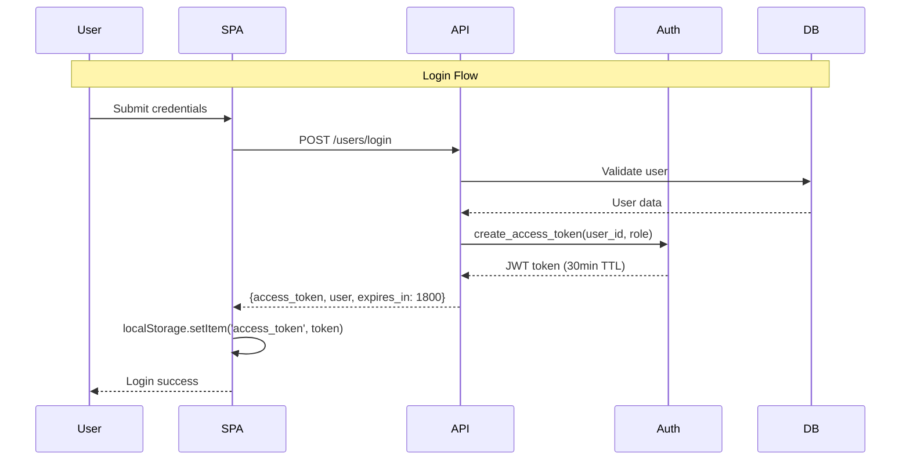
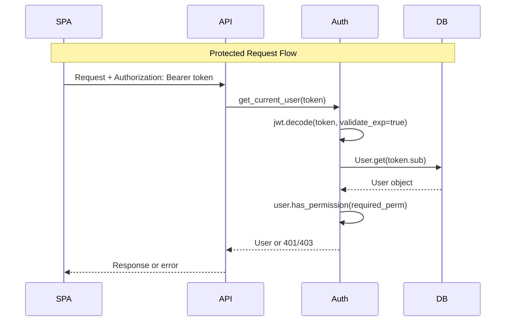
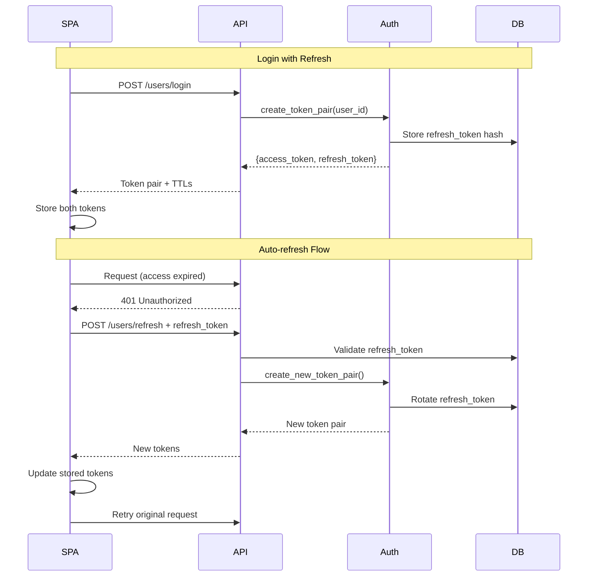

# Authentication Architecture Options

## 1. Overview

The authentication system requires unification to address current gaps: dual JWT libraries (python-jose/PyJWT), mismatched TTL configurations (30min config vs 24h response), inconsistent storage keys (`auth_token` vs `access_token`), and divergent frontend patterns (centralized interceptors vs manual headers). The goals are to establish a single JWT library, canonical token claims with `sub=user_id`, standardized frontend handling, and consistent security policies across both the customer web SPA and admin panel while maintaining the existing role-based access control system.

## 2. Option A — Unified JWT (Access-only) with Single Library (Preferred MVP)

### Architecture
- **Single JWT Library**: python-jose (current creation path) or PyJWT (current validation path)
- **Canonical Claims**: `sub=user_id`, `role`, `exp`, `iat`
- **TTL**: 30 minutes (align config with response)
- **Storage**: localStorage with unified `access_token` key
- **Logout**: Stateless (client-side token removal only)
- **Error Handling**: Standardized 401→redirect, 403→permission denied

### Flow Diagrams

### Pros/Cons
**Pros:**
- Simple implementation, minimal changes required
- Maintains current stateless architecture
- Low operational complexity
- Compatible with existing client patterns

**Cons:**
- Frequent re-authentication (30min sessions)
- No graceful session extension
- localStorage XSS vulnerability remains
- No server-side session control

### Rollout Risk: **Low**
- Backward compatible with frontend token handling
- Requires only library consolidation and TTL alignment

## 3. Option B — Access + Refresh Tokens (ROTATE)

### Architecture
- **Access Token**: 15-30 minutes, standard JWT claims
- **Refresh Token**: 7 days, rotation on use, database tracking
- **Storage Options**: 
  - localStorage (both tokens) - simpler but XSS vulnerable
  - HttpOnly cookies (refresh) + localStorage (access) - CSRF protection needed
- **Revocation**: Server-side refresh token blacklist

### Flow Diagrams

### Pros/Cons
**Pros:**
- Longer effective sessions (7 days)
- Server-side revocation capability
- Better UX (no frequent re-login)
- Compromise detection through rotation

**Cons:**
- Increased complexity (refresh logic, rotation, storage)
- Database overhead for refresh token tracking
- CSRF considerations if using cookies
- More attack vectors (two tokens to secure)

### Rollout Risk: **Medium**
- Requires new endpoints and frontend refresh logic
- Database schema changes for refresh token storage

## 4. Option C — HttpOnly Cookie Sessions (Server-managed)

### Architecture
- **Session Cookie**: HttpOnly, Secure, SameSite=Strict
- **CSRF Token**: Separate header/form token for state-changing operations
- **Server Storage**: Session data in database or Redis
- **Invalidation**: Immediate server-side session destruction

### Pros/Cons
**Pros:**
- XSS protection (HttpOnly cookies)
- Immediate revocation capability
- Fine-grained session control
- CSRF protection when properly implemented

**Cons:**
- Requires session storage infrastructure
- CSRF token complexity
- Subdomain sharing challenges
- Not compatible with mobile apps/APIs

### Rollout Risk: **High**
- Major architectural change from stateless to stateful
- Requires session storage layer
- Significant frontend changes

## 5. Cross-Cutting Concerns (Compare Across Options)

### Library Consolidation
| Concern | Option A | Option B | Option C |
|---------|----------|----------|----------|
| **JWT Library** | Single choice | Single choice | N/A (sessions) |
| **Claims Mapping** | Migrate sub→user_id | Same migration | N/A |
| **TTL Alignment** | Fix 30min mismatch | Multiple TTL config | Session timeout |

### Authentication Dependencies
| Concern | Option A | Option B | Option C |
|---------|----------|----------|----------|
| **Optional Auth** | `get_current_user()` | Same pattern | Session lookup |
| **Error Handling** | 401→redirect | 401→refresh→retry | 401→redirect |
| **Frontend Standard** | Unified interceptor | Refresh interceptor | Cookie handling |

### Security Posture
| Concern | Option A | Option B | Option C |
|---------|----------|----------|----------|
| **XSS Protection** | None (localStorage) | Partial (refresh cookies) | Full (HttpOnly) |
| **CSRF Protection** | CORS only | SameSite + CSRF | CSRF tokens |
| **Token Revocation** | None (stateless) | Refresh blacklist | Immediate |
| **Rate Limiting** | Login endpoint | Login + refresh | Login + session |

## 6. Recommendation (Non-binding)

**Option A - Unified JWT (Access-only)** is recommended as the MVP approach for the following reasons:

### Assumptions
- Current 30-minute sessions are acceptable for user workflows
- Stateless architecture provides operational simplicity
- XSS risk is mitigated through other security measures
- No immediate SSO or multi-domain requirements

### Trade-offs Accepted
- **Security**: localStorage XSS vulnerability vs implementation simplicity
- **UX**: 30-minute re-authentication vs no refresh token complexity  
- **Operations**: No server-side revocation vs no session storage requirements
- **Development**: Minimal changes vs comprehensive security enhancement

### Implementation Path
1. Consolidate to single JWT library
2. Fix TTL configuration alignment  
3. Unify frontend storage keys and interceptors
4. Standardize error handling patterns

## 7. Migration Plan (Minimal, Non-breaking)

### Phase 1: Backend Consolidation (Week 1)
- Choose primary JWT library (python-jose recommended for creation consistency)
- Update `app/api/dependencies.py` to use same library as `app/core/auth.py`
- Fix TTL mismatch: align `jwt_access_token_expire_minutes` with `expires_in` response
- Maintain dual validation during transition

### Phase 2: Claims Standardization (Week 2)  
- Update token creation to use `sub=user_id` instead of username
- Modify validation to accept both formats temporarily
- Add deprecation warnings for username-based sub claims

### Phase 3: Frontend Unification (Week 3)
- Standardize Web SPA to use `access_token` storage key
- Implement centralized HTTP client in Admin Panel with interceptors
- Unify error handling patterns (401 cleanup, 403 messaging)

### Phase 4: Cleanup (Week 4)
- Remove secondary JWT library imports
- Remove legacy `sub=username` validation support  
- Remove deprecated storage key handling
- Validate end-to-end authentication flows

## 8. Open Questions

1. **JWT Library Choice**: Should we standardize on python-jose (current token creation) or PyJWT (current validation), and is a 4-week migration timeline acceptable?

2. **Final TTL Decision**: Confirm target access token lifespan - 30 minutes (better security) or 24 hours (better UX) - and acceptable re-authentication frequency for users?

3. **Refresh Token Strategy**: Given the MVP recommendation of access-only tokens, do you want to revisit refresh tokens in a future phase, or commit to stateless 30-minute sessions?

4. **Cookie Migration Path**: If localStorage XSS risk becomes unacceptable, what's the timeline and priority for migrating to HttpOnly cookies with CSRF protection?

5. **Endpoint Authentication Audit**: Should we review all current public endpoints (leads, orders, parts creation) to determine if any should now require authentication?

6. **SSO Future Requirements**: Are there planned integrations with external identity providers or multi-domain deployment that would influence the architecture choice timeline?
