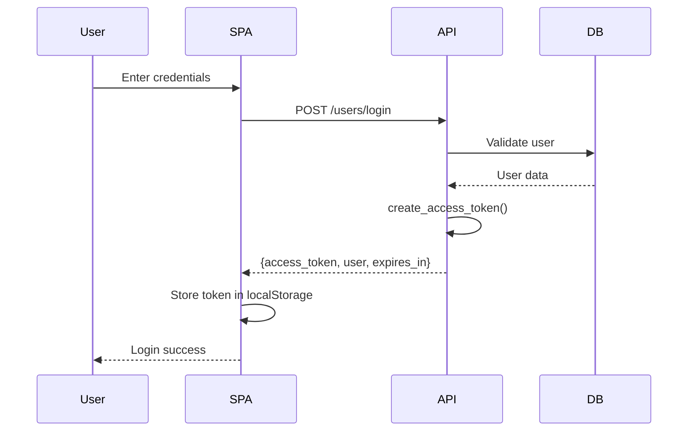
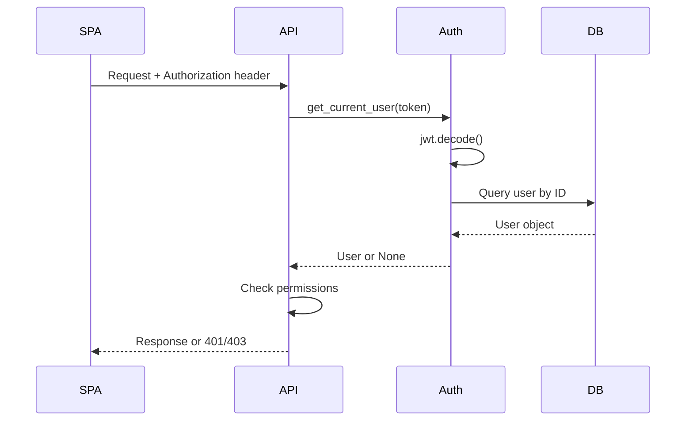
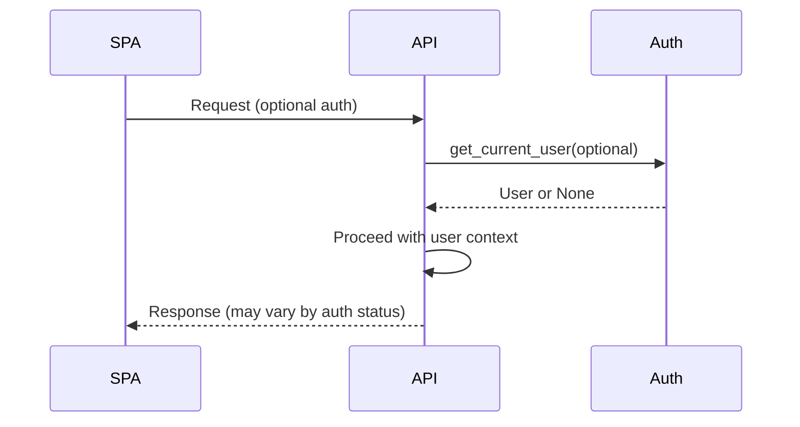

# Authentication System Current State Analysis

## 1. Overview

The authentication system is built around JWT (JSON Web Tokens) with a unified backend API serving both the customer-facing web SPA and the admin panel SPA. The backend enforces authentication through FastAPI dependencies, using a shared User model with role-based access control (RBAC). Both frontends store tokens in localStorage and communicate with the same authentication endpoints, though they implement different client-side patterns and use different storage keys.

## 2. Backend Auth (API)

### Auth Flow
**Login → Token Issuance → Protected Route Checks → Logout**

1. **Login**: `POST /api/v1/users/login` (app/api/routers/users.py:39-77)
2. **Token Creation**: `create_access_token()` in app/core/auth.py:32-44
3. **Token Validation**: `get_current_user()` in app/api/dependencies.py:20-61
4. **Logout**: `POST /api/v1/users/logout` (app/api/routers/users.py:80-94)

### JWT Details
- **Libraries**: Both `python-jose` (app/core/auth.py:9) and `PyJWT` (app/api/dependencies.py:7) are imported
- **Claims Used**: 
  - `sub`: Username (app/core/auth.py:51, app/api/routers/users.py:64)
  - `user_id`: User ID (app/api/routers/users.py:64)
  - `role`: User role (app/api/routers/users.py:64)
  - `exp`: Expiration (app/core/auth.py:41)
- **Signing Algorithm**: HS256 (app/core/config.py:64)
- **TTL Configuration**: 30 minutes (app/core/config.py:65) vs 86400 seconds returned (app/api/routers/users.py:75)

### Token Creation/Validation Locations
- **Creation**: `create_access_token()` in app/core/auth.py:32-44
- **Validation**: `get_current_user()` in app/api/dependencies.py:20-61
- **Alternative validation**: `verify_token()` in app/core/auth.py:47-60

### Authentication Dependencies
- **Required Auth**: `get_current_active_user()` (app/api/dependencies.py:64-75)
- **Optional Auth**: `get_current_user()` with `Optional[User]` (app/api/dependencies.py:20-61)
- **Usage Examples**:
  - Required: Most admin endpoints (app/api/routers/users.py:152)
  - Optional: PDP endpoints (app/api/routers/pdp.py:41), SMS endpoints (app/api/routers/sms.py:42)

### Role/Permission System
- **Definition**: User model has simple `role` field (app/db/models.py:186)
- **Permission Mapping**: Hard-coded in `has_permission()` method (app/db/models.py:233-272)
- **Roles**: super_admin, admin, manager, operator, pro, fleet, user
- **Enforcement**: Through dependency injection (app/api/dependencies.py:94-107)

### Backend Inconsistencies
- **Dual JWT Libraries**: Both python-jose and PyJWT imported
- **TTL Mismatch**: Config shows 30min, login response claims 24h (86400s)
- **Token Claim Inconsistency**: `sub` contains username in some places, user_id in others

## 3. Web Frontend (Customer SPA)

### Login Flow
- **Location**: `LoginModal.vue` (app/frontend/web/src/components/auth/LoginModal.vue:135-144)
- **API Call**: Uses `authStore.login()` which calls `pdpApi.client.post('/users/login')` (app/frontend/web/src/stores/auth.js:36)

### Token Storage
- **Method**: localStorage
- **Key**: `auth_token` (app/frontend/web/src/stores/auth.js:44)
- **Lifespan**: No client-side expiry handling, relies on 401 responses

### HTTP Client Configuration
- **Centralized Client**: `PDPApiClient` class in app/frontend/web/src/api/pdp.js:8-43
- **Request Interceptor**: Auto-adds Authorization header (app/frontend/web/src/api/pdp.js:20-29)
- **Response Interceptor**: Handles 401 by clearing token and redirecting (app/frontend/web/src/api/pdp.js:32-42)

### Permission/Role Checks
- **UI Level**: `isProUser`, `isAdmin` computed properties (app/frontend/web/src/stores/auth.js:17-23)
- **Role Detection**: Based on user.role field

### Error Handling
- **401 Handling**: Automatic token cleanup and redirect to /login
- **Error Structure**: Standardized error response handling (app/frontend/web/src/api/pdp.js:45-57)

## 4. Admin Panel (SPA)

### Login Flow
- **Location**: `LoginModal.vue` (app/frontend/panel/src/components/LoginModal.vue:123-141)
- **API Call**: Direct axios call to `/users/login` (app/frontend/panel/src/stores/auth.js:14-35)

### Token Storage
- **Method**: localStorage
- **Key**: `access_token` (app/frontend/panel/src/stores/auth.js:9, 25)
- **Lifespan**: No client-side expiry handling

### HTTP Client Configuration
- **No Centralized Client**: Direct axios usage in each store
- **No Interceptors**: Manual Authorization header addition per request
- **Examples**: Orders store (app/frontend/panel/src/stores/orders.js), Leads store (app/frontend/panel/src/stores/leads.js)

### Permission Checks
- **No Frontend Checks**: No role/permission validation in UI
- **Backend Reliance**: Depends entirely on backend permission enforcement

### Missing Authorization Headers
- **Store Actions**: Many store actions use direct axios without Authorization headers
- **Risk**: API calls may fail silently or bypass intended authentication

## 5. Single System or Divergent Paths?

### Shared Elements
- **Same Endpoints**: Both SPAs use identical API endpoints
- **Same Claims**: Backend returns same JWT structure
- **Same Backend Validation**: All routes use same dependency injection system

### Divergent Elements
- **Different Storage Keys**: `auth_token` vs `access_token`
- **Different Client Patterns**: Centralized with interceptors vs direct axios calls
- **Different Error Handling**: Automatic vs manual token cleanup

## 6. Security Considerations (Observed)

### Storage Risks
- **localStorage XSS**: Both SPAs vulnerable to XSS token theft
- **No HTTPOnly Option**: Tokens stored in accessible localStorage

### CSRF Posture
- **CORS Configured**: Specific origins allowed (app/api/main.py:40-45)
- **No CSRF Protection**: No additional CSRF tokens used

### Token Management
- **No Refresh Tokens**: Only access tokens, no refresh mechanism
- **Stateless Logout**: Backend logout doesn't revoke tokens server-side

### Public Endpoints
- **Some Protected**: Health check is public (app/api/main.py:55-57)
- **Some Open**: Leads, orders, parts creation have no auth requirements

## 7. Inconsistencies & Gaps

- **Token storage key mismatch**: `auth_token` vs `access_token`
- **Dual JWT libraries**: python-jose and PyJWT both imported
- **TTL configuration mismatch**: 30min config vs 24h response
- **Token claim inconsistency**: `sub` field usage varies
- **Missing HTTP interceptors**: Admin panel lacks centralized auth headers
- **No frontend permission validation**: Admin panel has no UI-level access control
- **Inconsistent error handling**: Different 401 response patterns
- **Manual header management**: Admin panel requires manual Authorization headers
- **No token refresh**: No mechanism for token renewal
- **Mixed authentication requirements**: Some endpoints optional, others required without clear pattern

## 8. Comparative Matrix

| Feature | Backend | Web Frontend | Admin Panel | Notes |
|---------|---------|--------------|-------------|-------|
| Login Endpoint | `/api/v1/users/login` | ✅ Same | ✅ Same | Unified |
| Token Library | python-jose + PyJWT | N/A | N/A | Inconsistent |
| JWT Claims | sub, user_id, role, exp | ✅ Receives all | ✅ Receives all | Unified |
| TTL Config | 30min | N/A | N/A | Returns 24h |
| Storage Key | N/A | `auth_token` | `access_token` | Different |
| HTTP Interceptor | N/A | ✅ Automated | ❌ Manual | Inconsistent |
| Optional Auth | ✅ Supported | ✅ Handled | ❌ Not handled | Partial |
| Permission UI Checks | N/A | ✅ Role-based | ❌ None | Inconsistent |
| Logout Behavior | Stateless | Token removal | Token removal | No revocation |
| Error Handling | Standard HTTP | Interceptor-based | Manual | Inconsistent |

## 9. File/Line Inventory

### Backend Core
- **app/core/auth.py → create_access_token()** → JWT creation with python-jose
- **app/core/auth.py → verify_token()** → JWT validation with python-jose
- **app/api/dependencies.py → get_current_user()** → JWT validation with PyJWT
- **app/api/routers/users.py → login()** → User authentication and token issuance
- **app/db/models.py → User.has_permission()** → Role-based permission checking

### Web Frontend
- **app/frontend/web/src/stores/auth.js → useAuthStore** → Composition API auth state
- **app/frontend/web/src/api/pdp.js → PDPApiClient** → Centralized HTTP client with interceptors
- **app/frontend/web/src/components/auth/LoginModal.vue** → Login UI component

### Admin Panel
- **app/frontend/panel/src/stores/auth.js → useAuthStore** → Options API auth state
- **app/frontend/panel/src/stores/orders.js** → Direct axios usage without auth headers
- **app/frontend/panel/src/components/LoginModal.vue** → Admin login UI

### Configuration
- **app/core/config.py → Settings** → JWT configuration and security settings
- **app/api/main.py → CORS setup** → Cross-origin configuration

## 10. Mermaid Diagrams

### Current Login Flow

### Protected Request Flow

### Optional Auth Path

## 11. Risks (Prioritized)

1. **Token Storage in localStorage** → XSS vulnerability can steal authentication tokens
2. **No Token Refresh Mechanism** → Users forced to re-login every 30 minutes (or 24 hours)
3. **Inconsistent Storage Keys** → Users can't share sessions between web and admin interfaces
4. **Missing Authorization Headers** → Admin panel API calls may fail or bypass security
5. **No Server-Side Token Revocation** → Logout doesn't invalidate tokens server-side
6. **Dual JWT Libraries** → Potential for token validation inconsistencies
7. **TTL Configuration Mismatch** → Unclear actual token expiration behavior
8. **No Frontend Permission Validation** → Admin users may see unauthorized UI elements
9. **Manual Error Handling in Admin** → Inconsistent user experience for auth failures
10. **No CSRF Protection** → Potential for cross-site request forgery attacks

## 12. Open Questions (for Stakeholders)

1. **Token Lifespan Strategy**: Should tokens expire in 30 minutes or 24 hours? Do you want refresh tokens for longer sessions?

2. **Storage Mechanism Preference**: Continue with localStorage, move to HTTPOnly cookies, or implement a hybrid approach?

3. **Session Sharing Expectation**: Should users be able to login once and access both web and admin interfaces, or maintain separate sessions?

4. **Permission Model Evolution**: Is the current simple role-based system sufficient, or do you need more granular permissions and feature flags?

5. **Logout Requirements**: Should logout immediately invalidate tokens server-side, or is client-side removal sufficient?

6. **SSO/Subdomain Strategy**: Are there plans for single sign-on or deployment across multiple subdomains that would affect token sharing?

7. **Audit and Reporting Needs**: Do you need to track user sessions, login attempts, or authentication events for compliance or analytics?
