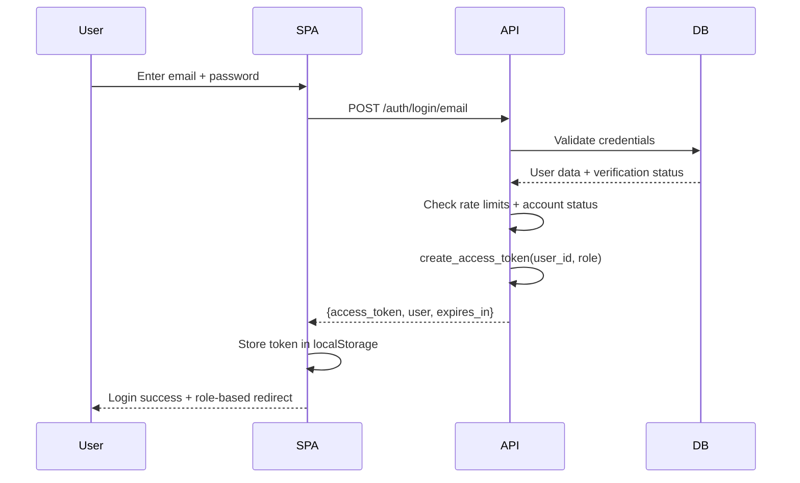
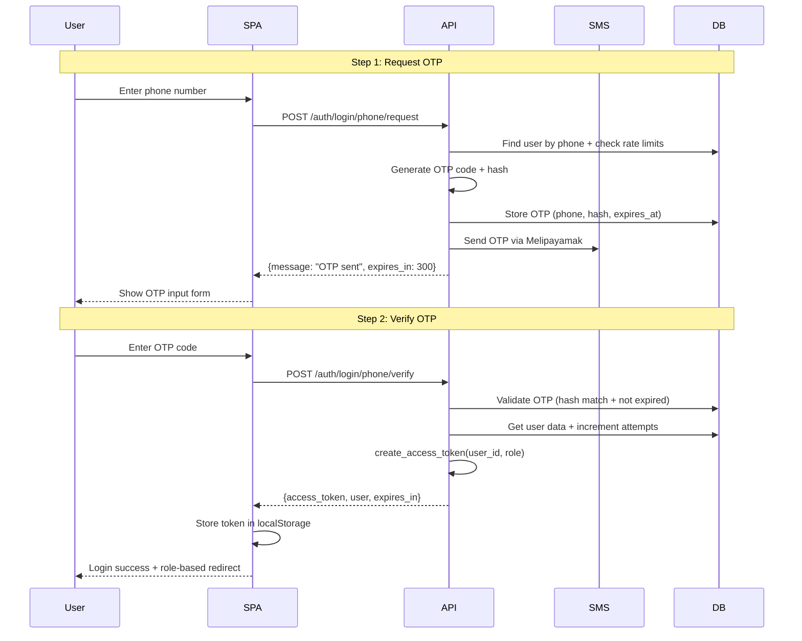
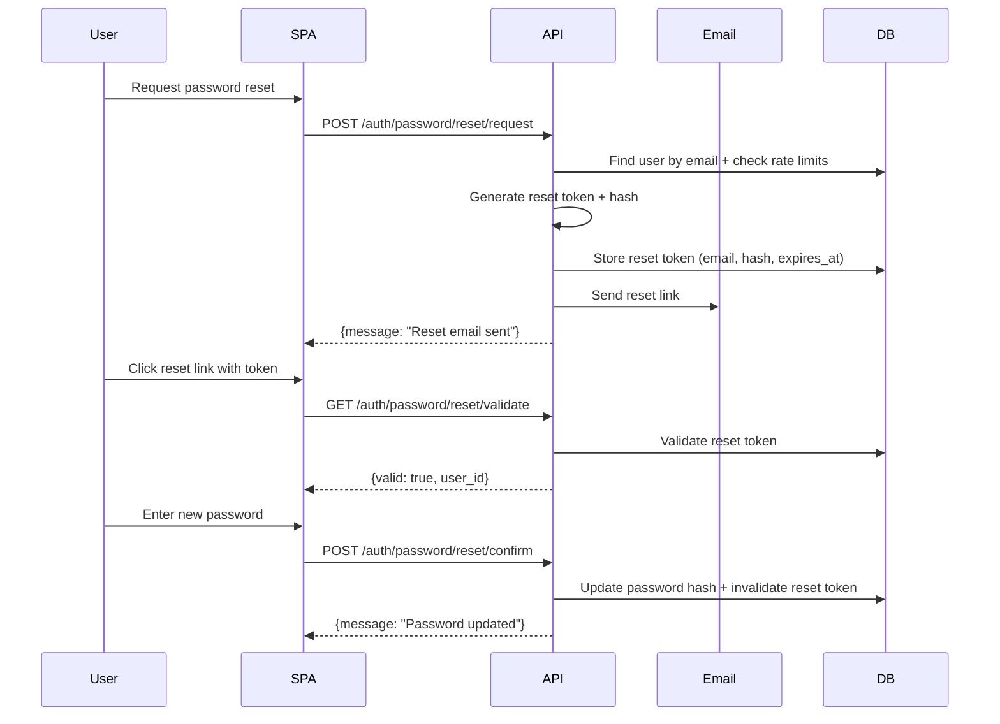
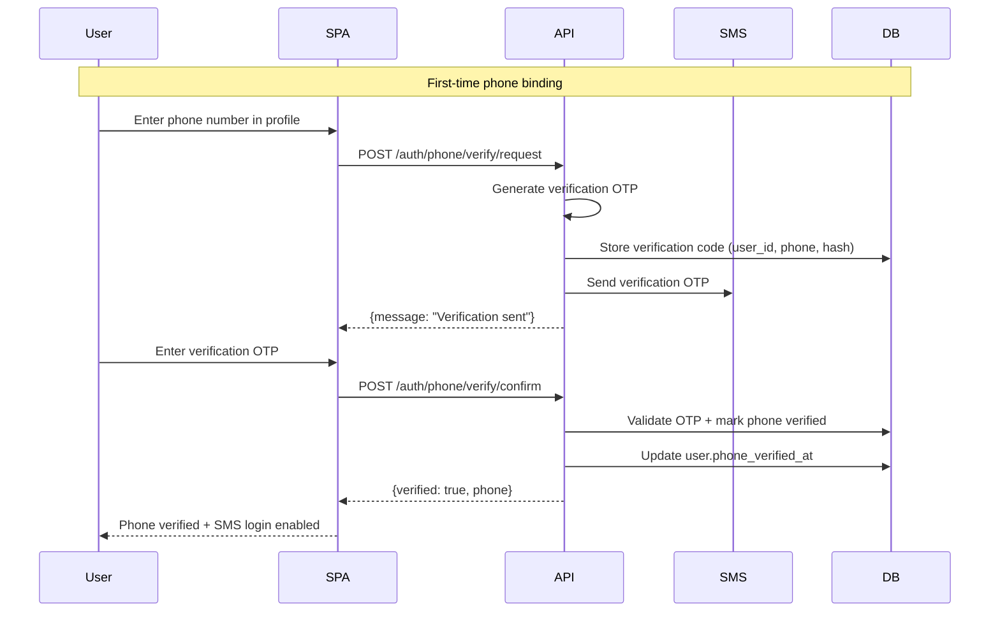

# Dual Login Authentication Vision

## 1. Goals & User Experience

### Authentication Methods
- **(A) Email + Password**: Traditional credential-based authentication for users with established accounts
- **(B) Phone + OTP (SMS)**: One-time password authentication for mobile-first users and enhanced security

### Unified Goals
- **Single Account Model**: Users can authenticate via either method with same underlying account and permissions
- **Consistent Token Claims**: Both authentication paths issue identical JWT structure with same TTL and role information
- **Unified Error Handling**: Standardized UX for rate limits, account lockout, and authentication failures across both methods
- **Brute Force Protection**: Per-IP and per-identifier rate limiting with progressive lockout policies
- **Audit Consistency**: All authentication events logged with same format regardless of method used

## 2. User Flows

### Email/Password Login Flow


### Phone + OTP Login Flow


### Password Reset Flow


### Phone Number Verification Flow


## 3. Policy Matrix

| Auth Method | TTL | Rate Limits | Max Retries | Lockout Policy | Delivery Provider | Audit Events |
|-------------|-----|-------------|-------------|----------------|-------------------|--------------|
| **login_email** | 30min | 5/min per IP | 3 failed attempts | 30min account lock | N/A | success/failure + IP hash |
| **login_phone** | 30min | 3/min per phone | 3 OTP attempts | 30min phone lock | Melipayamak SMS | OTP request/verify + phone hash |
| **reset_password** | 15min token | 2/hour per email | 1 reset attempt | 24h email cooldown | SMTP/Email service | reset request/confirm |
| **verify_phone** | 5min OTP | 3/hour per user | 3 verification attempts | 1h verification lock | Melipayamak SMS | verification request/confirm |

## 4. Data Model Sketch (Non-binding)

### Enhanced User Model
```sql
users table additions:
- email_verified_at: timestamp (null if unverified)
- phone: string (null if not provided)  
- phone_verified_at: timestamp (null if unverified)
- last_login_method: enum('email', 'phone', 'reset')
- failed_login_attempts: integer (reset on success)
- locked_until: timestamp (null if not locked)
```

### OTP Codes Table
```sql
otp_codes table:
- id: primary key
- user_id: foreign key (null for phone-only lookup)
- phone_number: string (E.164 format)
- email: string (for password reset)
- code_hash: string (hashed OTP, never plain text)
- code_type: enum('login', 'verification', 'reset')
- expires_at: timestamp (2-15min from creation)
- attempts: integer (increment on failed validation)
- created_at: timestamp
- used_at: timestamp (null until consumed)
```

### Optional Sessions Table (Future)
```sql
sessions table (if moving from stateless):
- session_id: UUID primary key
- user_id: foreign key
- login_method: enum('email', 'phone')
- ip_address_hash: string
- user_agent_hash: string
- expires_at: timestamp
- created_at: timestamp
- last_accessed_at: timestamp
```

## 5. Security Considerations

### OTP Code Protection
- **Code Hashing**: SHA-256 with application salt, never store plain text codes
- **Short Expiry**: 2-5 minutes for login OTP, 15 minutes for password reset tokens
- **Attempt Limiting**: Maximum 3 validation attempts before code invalidation
- **Replay Protection**: Single-use codes marked as consumed after successful validation

### Rate Limiting Strategy
- **Per-IP Limits**: Prevent distributed brute force attacks across different accounts
- **Per-Identifier Limits**: Prevent targeted attacks on specific phone numbers or email addresses
- **Progressive Backoff**: Exponential delay between attempts after failures
- **Cooldown Periods**: Temporary restrictions after repeated violations

### Account Security
- **Account Lockout**: 30-minute temporary lockout after 3 failed login attempts
- **Phone Verification Requirement**: SMS login only available for verified phone numbers
- **Password Policy**: Minimum complexity requirements for email/password authentication
- **Session Binding**: Optional IP address validation for sensitive operations

### Audit & Monitoring
- **Authentication Events**: All login attempts logged with method, timestamp, outcome
- **OTP Operations**: Code generation, delivery, and validation events tracked
- **Security Events**: Rate limit violations, account lockouts, suspicious patterns
- **PII Protection**: Phone numbers and emails hashed in audit logs

## 6. Non-Goals (MVP)

### Excluded Features
- **Magic Link Authentication**: Email-based passwordless login deferred to future iteration
- **Multi-Factor Authentication (2FA)**: Secondary authentication factors not included in initial scope
- **Social Login Integration**: OAuth providers (Google, Apple) excluded from MVP
- **Biometric Authentication**: Fingerprint, Face ID integration not planned
- **Hardware Security Keys**: FIDO2/WebAuthn support deferred

### Future Considerations
- **Account Recovery**: Advanced recovery options beyond email reset
- **Device Management**: Trusted device registration and management
- **Risk-Based Authentication**: Behavioral analysis and adaptive authentication
- **Enterprise SSO**: SAML or OAuth integration for business customers

## 7. User Experience Flows

### Authentication Method Selection
- **Primary Choice**: Email/password for existing users, phone/OTP for new mobile users
- **Fallback Options**: "Login with phone instead" and "Login with email instead" toggles
- **Account Linking**: Users can add phone to email account or email to phone account
- **Method Preference**: Remember last successful authentication method

### Error Handling Consistency
- **Rate Limit Exceeded**: "Too many attempts. Please try again in X minutes"
- **Account Locked**: "Account temporarily locked. Contact support or try again in 30 minutes"
- **Invalid Credentials**: "Invalid email/password" or "Invalid phone/OTP" with same visual treatment
- **Network Errors**: Consistent retry behavior and offline state handling

### Accessibility & Localization
- **RTL Support**: Persian/Farsi interface with proper text direction
- **Screen Reader**: Proper ARIA labels for authentication forms and error states
- **Keyboard Navigation**: Tab order and focus management for accessibility
- **Error Pronunciation**: Screen reader friendly error message formatting

## Client Storage Strategy & Migration
- Current MVP default: localStorage (key: `access_token`).
- Security caveat: XSS risk; tokens must never be logged or sent to third parties.
- Migration path (later): HttpOnly secure cookies with SameSite=Lax/Strict + CSRF token (double-submit or header).
- Preconditions for cookie migration: same-origin, CSRF middleware, TLS everywhere, no mixed content.
- Operational toggle: `auth.frontend.storage` policy flag to switch per environment.

## Localization (FA/EN)
- OTP/SMS and UI error strings should support FA/EN.
- Provide a translation map: `otp_sent`, `otp_invalid`, `otp_expired`, `resend_in_x`, `too_many_attempts`, `rate_limited`.
- RTL in Farsi views; LTR in English; error codes remain English in logs.

## Abuse Budget & Rate Limits
- Daily SMS budget cap (e.g., 300 SMS/day per environment) with alert at 80%.
- Rate limits:
  - Per-identifier: max 5 OTP requests / 30 min; resend cooldown 60s.
  - Per-IP: sliding window (e.g., 20 / 15 min) with exponential backoff.
  - Lockout after 5 failed OTP verifies within 15 min; auto-unlock after 30 min.
- Cost telemetry: emit `sms_sent`, `sms_failed`, `sms_cost_estimate` metrics.

## 8. Open Questions

1. **OTP Time-to-Live**: Should SMS login codes expire in 2 minutes (security) or 5 minutes (usability), and should password reset tokens use the same TTL or longer (15 minutes)?

2. **SMS Provider Strategy**: Continue with Melipayamak as primary SMS provider, or implement fallback providers for improved delivery reliability?

3. **Lockout Policy Granularity**: Should account lockout apply to both email and phone login methods, or maintain separate lockout states per authentication method?

4. **OTP Resend Limits**: How many times can users request a new OTP code within the cooldown period, and should resend requests extend the lockout timer?

5. **CAPTCHA Integration**: At what failed attempt threshold should CAPTCHA be required for both email and phone authentication methods?

6. **Password Policy Enforcement**: What minimum requirements for password complexity (length, character types, common password checks) should be enforced?

7. **Multi-Language Support**: Should OTP SMS messages and password reset emails support both English and Persian, and how does this affect template management?

8. **Account Recovery Escalation**: What manual recovery process should be available when users are locked out of both email and phone authentication methods?
