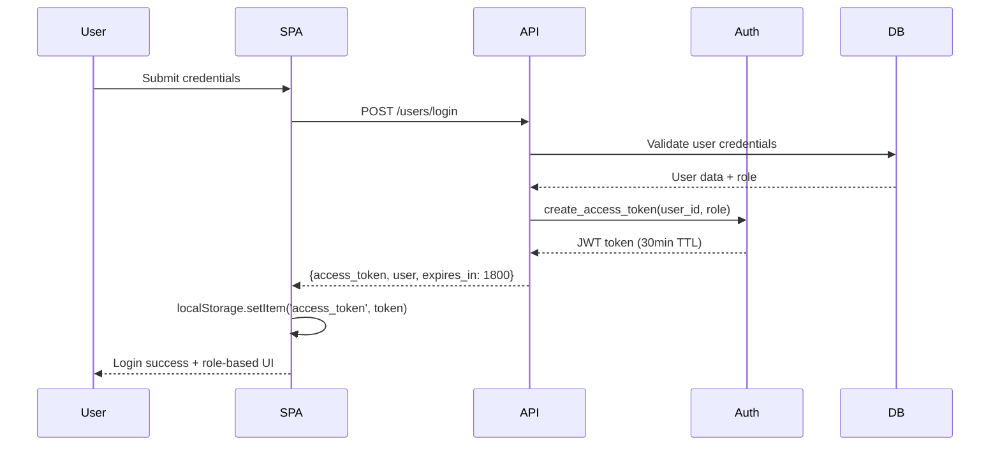

# RFC: Target Authentication Architecture

## 1. Decision Summary

**Chosen Option**: Option A - Unified JWT (Access-only) with Single Library

**Scope**: 
- Consolidate dual JWT libraries into single validation/creation path
- Standardize token claims with `sub=user_id` canonical format
- Align TTL configuration with API response values
- Unify frontend storage keys and HTTP interceptor patterns across Web and Admin SPAs

**Non-Goals (MVP)**:
- No refresh token implementation
- No session-based authentication
- No SSO or multi-domain support
- No breaking changes to existing API contracts
- No migration to HttpOnly cookies

## 2. Architecture Snapshot

### Target Login Flow


### Target Protected Request Flow
```mermaid
sequenceDiagram
    participant SPA
    participant API
    participant Auth
    participant DB

    SPA->>API: Request + Authorization: Bearer <token>
    API->>Auth: get_current_user(token)
    Auth->>Auth: jwt.decode(token, validate_exp=true)
    Auth->>DB: User.get(token.sub) # sub=user_id
    DB-->>Auth: User object
    Auth->>Auth: user.has_permission(required)
    Auth-->>API: User or raise 401/403
    API-->>SPA: Response or standardized error
    Note over SPA: 401→clear token+redirect; 403→show error
```

### Canonical Claims Structure
```json
{
  "sub": 12345,               // User ID (integer, not username)
  "role": "admin",            // Single role string
  "exp": 1234567890,          // Unix timestamp (30min from iat)
  "iat": 1234567890           // Issued at timestamp
}
```

**Signing Algorithm**: HS256 with configuration-managed secret key rotation capability

## 3. Standards & Contracts

### JWT Library Standard
- **Single Library**: python-jose (chosen for current token creation consistency)
- **Decode Path**: All validation through unified `get_current_user()` in app/api/dependencies.py
- **Creation Path**: All token issuance through `create_access_token()` in app/core/auth.py

### Token Lifespan Standard
- **Access Token TTL**: 30 minutes (1800 seconds)
- **Configuration Source**: `jwt_access_token_expire_minutes` in app/core/config.py
- **Client Communication**: `expires_in` field in login response must equal TTL config value
- **Validation**: Both config and response values monitored for alignment

### Frontend Standardization
- **Unified Storage Key**: `access_token` (adopt Admin Panel convention)
- **HTTP Interceptor Behavior**: 
  - Request: Auto-inject `Authorization: Bearer <token>` header
  - Response: 401→clear token+redirect to login, 403→display permission error
- **Error UX**: Consistent messaging across Web and Admin SPAs
- **Token Lifecycle**: Initialize on app startup, clear on logout/401

## 4. Compatibility & Migration

### Transitional Support (8-week window)
- **Legacy Claims**: Accept both `sub=username` and `sub=user_id` during validation
- **Dual Library Support**: Maintain PyJWT validation alongside python-jose creation
- **Storage Key Migration**: Support both `auth_token` and `access_token` reads with deprecation warnings
- **Claim Preference**: New tokens use canonical format; validation prioritizes `sub=user_id` when present

### Migration Timeline
- **Week 1-2**: Backend library consolidation and TTL alignment
- **Week 3-4**: Claims standardization with backward compatibility
- **Week 5-6**: Frontend storage key unification and interceptor implementation
- **Week 7-8**: Legacy support removal and validation cleanup

### API Contract Guarantee
- No changes to request/response schemas for `/users/login`, `/users/logout`, `/users/me`
- Existing client integrations continue without modification
- Token format remains JWT with same HTTP Bearer authentication

## 5. Security & Compliance

### Storage Choice Rationale
- **localStorage Selection**: Maintains development simplicity and client-side session management
- **XSS Mitigation**: Content Security Policy (CSP) headers and input sanitization as primary defenses
- **Future Enhancement**: HttpOnly cookie migration path preserved for security-sensitive deployments

### Logout Semantics
- **Stateless Approach**: Client-side token removal without server-side revocation
- **Rationale**: Short TTL (30min) limits compromise window; operational simplicity
- **Session Cleanup**: Clear localStorage, remove HTTP headers, redirect to login

### Audit Requirements
- **Login Events**: Success/failure with hashed IP, timestamp, user agent fingerprint
- **Token Decode Errors**: Rate monitoring for brute force detection
- **Authorization Failures**: 401/403 counts per route for access pattern analysis
- **Retention**: 90 days for authentication logs, 30 days for operational metrics

## 6. KPIs & Acceptance Criteria

### Performance Targets
- **Authentication Success Rate**: ≥99% for valid credentials
- **Login Latency (p95)**: ≤500ms from credential submission to token response
- **Authorization Error Rate**: ≤1% of authenticated requests result in 401/403
- **Token Validation Consistency**: Zero decode mismatches between libraries post-cutover

### Functional Acceptance
- **Cross-SPA Compatibility**: Users can authenticate in Web SPA and access Admin Panel with same token
- **Protected Route Consistency**: All admin-only endpoints return 403 for non-admin users
- **Error Handling Parity**: Both SPAs show identical login/permission error messages
- **Configuration Alignment**: `jwt_access_token_expire_minutes` matches `expires_in` response field

### Technical Validation
- **Single JWT Library**: Only one JWT import across entire backend codebase
- **Claims Validation**: All new tokens contain `sub=user_id` format
- **Storage Unification**: Both SPAs use `access_token` localStorage key
- **Interceptor Coverage**: Admin Panel has automated Authorization header injection

## 7. Rollout & Backout Plan

### Rollout Steps
1. **Library Consolidation**: Update app/api/dependencies.py to use python-jose; maintain PyJWT fallback
2. **TTL Alignment**: Fix config/response mismatch; update login endpoint response
3. **Claims Migration**: Create tokens with `sub=user_id`; validate both formats temporarily  
4. **Frontend Unification**: Update Web SPA storage key; implement Admin Panel interceptors
5. **Legacy Cleanup**: Remove PyJWT imports; remove `sub=username` validation; remove `auth_token` support

### Backout Strategy
- **Library Revert**: Re-enable PyJWT validation path in app/api/dependencies.py
- **Claims Rollback**: Restore `sub=username` token creation and validation
- **Storage Fallback**: Re-enable dual storage key support (`auth_token`/`access_token`)
- **Config Restoration**: Revert TTL changes to previous mismatch state

### Risk Mitigation
- **Gradual Migration**: Each phase can be independently rolled back
- **Feature Flags**: Enable/disable new validation logic without deployment
- **Monitoring**: Real-time auth error rate tracking during migration phases
- **Validation Testing**: Automated tests for both legacy and new token formats

## 8. Open Questions (Final Blockers)

1. **JWT Library Decision**: Confirm python-jose as the standard library and approve 8-week migration timeline to remove PyJWT dependencies?

2. **Final TTL Configuration**: Lock in 30-minute access token lifespan and confirm this meets user workflow requirements without excessive re-authentication friction?

3. **Legacy Support Window**: Approve 8-week transitional period for `sub=username` and dual storage key support, or adjust timeline based on client update capabilities?

4. **Public Endpoints Whitelist**: Finalize which routes remain publicly accessible (`/health`, `/vehicles`, `/categories`, `/parts` read-only) versus requiring authentication?

5. **Future Enhancement Priority**: Establish timeline for potential HttpOnly cookie migration or refresh token implementation based on security posture evolution needs?
