# Telegram SSO Architecture

## 1. Objectives

### Single Account Recognition
A user authenticated on the web portal should be automatically recognized by the Telegram bot with the same account permissions and profile data, and vice versa. This enables seamless cross-platform experiences where users can initiate product searches on web and continue conversations in Telegram, or receive order updates through both channels without re-authentication.

### Secure Account Linking
Establish cryptographically secure association between web user accounts and Telegram user IDs through mutual verification flows that prevent account hijacking, maintain audit trails, and support unlinking for account security. The linking process should not rely on potentially spoofable phone number matching but require explicit user consent through both platforms.

## 2. Linking Flows

### Flow A: Web → Bot Linking (User Authenticated on Web)

```mermaid
sequenceDiagram
    participant User
    participant Web
    participant API
    participant TgBot
    participant DB

    Note over User,DB: User already logged into Web Portal
    User->>Web: Click "Connect Telegram"
    Web->>API: POST /auth/telegram/link/request
    API->>API: Generate link_token + nonce
    API->>DB: Store token(user_id, nonce, expires_at)
    API-->>Web: {link_token, deep_link_url}
    Web-->>User: Show "Open in Telegram" button

    User->>TgBot: Click t.me link → /start <link_token>
    TgBot->>API: POST /auth/telegram/link/verify
    API->>DB: Validate token + nonce + not expired
    API->>DB: Link telegram_user_id ↔ user_id
    API->>DB: Mark token as used
    API-->>TgBot: {success: true, user_name}
    TgBot-->>User: "✅ Account linked! You're now connected as [Name]"
    
    Note over User,DB: Future bot interactions use linked account
```


### Flow B: Bot → Web Sign-in

```mermaid
sequenceDiagram
    participant User
    participant TgBot
    participant API
    participant Web
    participant DB

    User->>TgBot: /login command
    TgBot->>API: POST /auth/telegram/web-login/request
    API->>DB: Find user by telegram_user_id
    API->>API: Generate login_token + nonce
    API->>DB: Store token(user_id, nonce, expires_at)
    API-->>TgBot: {login_token, web_login_url}
    TgBot-->>User: "🔗 Tap to login: [Open Web Portal]"

    User->>Web: Click login link → /login?token=<login_token>
    Web->>API: POST /auth/telegram/web-login/verify
    API->>DB: Validate token + nonce + not expired
    API->>DB: Get user data by token.user_id
    API->>API: create_access_token(user_id, role)
    API->>DB: Mark login token as used
    API-->>Web: {access_token, user, expires_in}
    Web->>Web: Store token + redirect to dashboard
    Web-->>User: Authenticated in web portal
```


## 3. Data Model Sketch (Non-binding)

### Enhanced User Model
```sql
users table additions:
- telegram_user_id: bigint (nullable, unique index)
- telegram_username: string (nullable, for display)
- telegram_linked_at: timestamp (null if not linked)
- telegram_first_name: string (nullable, from Telegram profile)
- telegram_last_name: string (nullable, from Telegram profile)
```

### Alternative: Account Links Table
```sql
account_links table:
- id: primary key
- user_id: foreign key to users
- provider: enum('telegram', 'google', 'apple') # extensible
- provider_user_id: string (telegram_user_id as string)
- provider_username: string (nullable)
- linked_at: timestamp
- last_used_at: timestamp (updated on bot interactions)
```

### Short-lived Tokens Table
```sql
link_tokens table:
- id: primary key
- token_type: enum('web_to_bot', 'bot_to_web')
- token_hash: string (hashed token, never plain text)
- nonce: string (cryptographic nonce for replay protection)
- user_id: foreign key (null for web_to_bot before linking)
- telegram_user_id: bigint (null for bot_to_web requests)
- expires_at: timestamp (2-5 minutes from creation)
- used_at: timestamp (null until consumed)
- created_at: timestamp
- ip_address_hash: string (rate limiting by IP)
```

## 4. Security Considerations

### Token Security
- **Single-Use Enforcement**: Tokens marked as consumed after successful verification, cannot be reused
- **Short TTL**: 2-5 minute expiration window to limit exposure window for intercepted tokens
- **Cryptographic Nonce**: Server-generated randomness prevents token prediction and replay attacks
- **Hash Storage**: Token values hashed in database using SHA-256 with application salt

### Verification Requirements
- **Mutual Consent**: Both web portal and Telegram bot must confirm linking action
- **No Phone Number Trust**: Telegram phone numbers not used for account matching due to potential spoofing
- **Explicit User Action**: Linking requires deliberate user interaction in both platforms
- **Account Ownership**: Web session validates user controls account before issuing link token

### Rate Limiting & Abuse Prevention
- **Link Attempt Limits**: Maximum 3 linking attempts per user per hour
- **IP-based Limiting**: Maximum 10 link requests per IP address per hour
- **Token Generation Limits**: Maximum 5 link tokens per user per day
- **Failed Verification Tracking**: Progressive delays after failed token validation attempts

### Audit & Monitoring
- **Link Events**: All successful and failed linking attempts logged with timestamp and IP
- **Token Usage**: Track token generation, verification attempts, and expiration events
- **Unlink Events**: Account disconnection events with reason (user-initiated vs admin action)
- **Cross-Platform Activity**: Monitor for suspicious patterns across web and Telegram interactions

## 5. User Experience Flows

### Linking Success Flow
- **Web Portal**: "✅ Telegram account connected successfully. You can now receive order updates and support through Telegram."
- **Telegram Bot**: "🎉 Your account is now linked! I can help you with orders, tracking, and product searches."
- **Visual Confirmation**: Both platforms show linked account status and last connection time

### Linking Failure Scenarios
- **Expired Token**: "This connection link has expired. Please request a new link from the web portal."
- **Already Linked**: "This Telegram account is already connected to another user. Please unlink first or contact support."
- **Rate Limited**: "Too many connection attempts. Please wait 1 hour before trying again."
- **Network Error**: "Connection failed. Please check your internet and try again."

### Account Management UX
- **Link Status Display**: Web portal shows "Connected to @username" with last activity timestamp
- **Unlink Option**: "Disconnect Telegram" button in account settings with confirmation dialog
- **Re-link Process**: Clear instructions for connecting a different Telegram account
- **Support Access**: Help documentation and contact options for linking issues

## 6. Integration with Existing Systems

### SMS Service Compatibility
- **Melipayamak Integration**: Leverage existing SMS infrastructure for OTP delivery in phone authentication
- **Template Consistency**: Use same SMS template system for both OTP and linking confirmation messages
- **Delivery Tracking**: Apply same SMS analytics and delivery monitoring to linking-related messages

### Role-Based Access
- **Permission Inheritance**: Telegram bot interactions inherit web account role and permissions
- **Admin Panel Access**: Linked accounts visible in admin panel with Telegram username display
- **Cross-Platform Permissions**: Pro/Fleet pricing visible in bot for users with elevated web roles

### Authentication Token Compatibility
- **Same JWT Structure**: Tokens issued via Telegram linking use identical claims as web authentication
- **Cross-Platform Sessions**: Users remain authenticated in web portal after linking through Telegram
- **Unified Logout**: Optional logout from one platform can terminate sessions in both

## 7. Security Architecture

### Deep Link Security
- **Domain Validation**: Telegram deep links only accept tokens from verified backend API
- **HTTPS Enforcement**: All web login links use HTTPS to prevent token interception
- **Referrer Policy**: Strict referrer policy to prevent token leakage through HTTP headers
- **URL Parameter Sanitization**: Tokens immediately consumed and removed from browser history

### Account Protection
- **Concurrent Link Prevention**: Only one Telegram account can be linked per user account
- **Link Verification**: Both platforms must confirm successful linking before activation
- **Automatic Unlinking**: Suspicious activity patterns can trigger automatic account disconnection
- **Admin Override**: Support team can manually unlink accounts for security or support purposes

### Privacy Considerations
- **Minimal Data Collection**: Only necessary Telegram profile fields stored (user ID, username, first name)
- **Data Retention**: Telegram profile data updated on each interaction, expired data purged
- **Consent Tracking**: Explicit consent timestamp for data sharing between platforms
- **GDPR Compliance**: User right to disconnect and delete Telegram-associated data

## Threat Model (Concise)

| Attack | Vector | Impact | Control |
|--------|--------|--------|---------|
| **Token replay** | Reusing start/login tokens | Account takeover | Single-use tokens + nonce + server-side state + short TTL (2–5m) + mark used_at |
| **Token leakage in deep-links** | Copying `start`/`token` URL | Unauthorized link/login | HTTPS-only links, warn not to share links, expire quickly, domain allowlist |
| **Brute-force link attempts** | Guessing tokens | Link flood / abuse | High-entropy tokens, rate-limit per IP/telegram_user_id, audit anomalies |
| **Impersonation via phone** | Assuming phone = identity | Wrong account linking | Never trust phone from Telegram; require explicit link flow + user confirmation |
| **CSRF on web exchange** | Abusing exchange endpoint | Unintended login | Bind token to intended audience + origin checks + single-use |

## Edge Cases (Link/Unlink)
- Linking when `telegram_user_id` is already bound → respond `ALREADY_LINKED` with guidance to unlink first.
- Unlink when not linked → idempotent success (no-op) and audit event.
- User changes email/phone after link → link persists (by user_id); recommend re-verify phone if policy requires.
- Multiple Telegram accounts per user: default NO (one-to-one); if enabled later, enforce uniqueness rules in `account_links`.

## Deep-Link & Domain Policy
- Deep-link domain allowlist; reject tokens redeemed from non-allowed origins.
- For web login via bot, enforce `redirect_uri` allowlist and attach `state` to mitigate mixups.
- Set token audience (`aud`) to `web` or `bot` depending on flow.

## 8. Open Questions

1. **Link Token TTL Policy**: Should linking tokens expire in 2 minutes (high security) or 5 minutes (better usability), and should this differ from OTP token TTL?

2. **Multiple Telegram Account Support**: Should users be able to link multiple Telegram accounts to one web account, or maintain strict 1:1 mapping for security?

3. **Default Linking Initiation**: Should the primary linking flow start from web portal (current design) or should Telegram bot also offer proactive linking suggestions?

4. **Localization Strategy**: Should Telegram bot messages support both English and Persian based on user's web portal language preference, or maintain separate language detection?

5. **Unlink Security Policy**: Should account unlinking require re-authentication in the originating platform, or allow immediate disconnection for user convenience?

6. **Cross-Platform Session Behavior**: When users logout from web portal, should their Telegram bot session also be invalidated, or maintain independent session lifecycles?

7. **Deep Link Domain Configuration**: Should the web login deep link domain be configurable per deployment environment (staging/production), and what validation is required?

8. **Audit Data Retention**: Should Telegram linking events follow the same 90-day retention policy as web authentication, or require longer retention for security analysis?
