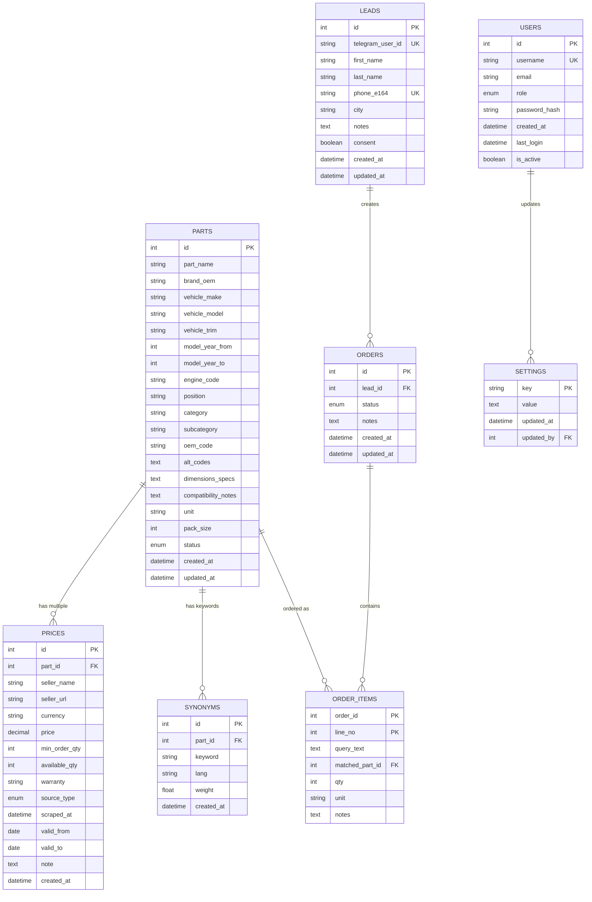

# Chinese Auto Parts Price Bot - Data Model Documentation

## 1. Purpose & Scope

This data model supports the core Telegram bot workflow (part search → confirmation → contact capture → order creation) while enabling comprehensive admin operations for managing parts, prices, customers, and orders. The schema is designed to handle both AI-powered semantic search and basic/fuzzy search, with flexible price management and multi-language support for Persian keywords.

## 2. Entity Overview

- **`parts`**: Core part definitions with vehicle compatibility and technical specifications
- **`prices`**: Multiple price points per part with source tracking and validity periods
- **`synonyms`**: Keywords and aliases for enhanced search capabilities in multiple languages
- **`leads`**: Customer information captured through Telegram with contact details
- **`orders`**: Formal purchase requests linked to leads with status tracking
- **`order_items`**: Individual line items within orders with part matching
- **`settings`**: System configuration and feature flags (AI toggle, bulk limits)
- **`users`**: Admin panel users with role-based access control

## 3. ER Diagram



## 4. Table Specifications

### parts

| Column | Type | Nullable | Default | Example | Description |
|--------|------|----------|---------|---------|-------------|
| `id` | INT | NO | AUTO_INCREMENT | 1 | Primary key |
| `part_name` | VARCHAR(255) | NO | - | "Front Brake Pad" | Human-readable part name |
| `brand_oem` | VARCHAR(100) | NO | - | "Chery" | Original equipment manufacturer |
| `vehicle_make` | VARCHAR(100) | NO | - | "Chery" | Vehicle manufacturer |
| `vehicle_model` | VARCHAR(100) | NO | - | "Tiggo 8" | Specific vehicle model |
| `vehicle_trim` | VARCHAR(100) | YES | NULL | "Pro" | Vehicle trim/variant |
| `model_year_from` | INT | YES | NULL | 2020 | First model year |
| `model_year_to` | INT | YES | NULL | 2024 | Last model year |
| `engine_code` | VARCHAR(50) | YES | NULL | "SQRF4J16" | Engine specification |
| `position` | VARCHAR(50) | YES | NULL | "Front-Left" | Part position on vehicle |
| `category` | VARCHAR(100) | NO | - | "Brake System" | Primary category |
| `subcategory` | VARCHAR(100) | YES | NULL | "Brake Pads" | Secondary category |
| `oem_code` | VARCHAR(100) | YES | NULL | "CH123456" | Official OEM part number |
| `alt_codes` | TEXT | YES | NULL | "CH123456,ALT789" | Alternative part codes |
| `dimensions_specs` | TEXT | YES | NULL | `{"length": 120, "width": 80}` | Technical specifications |
| `compatibility_notes` | TEXT | YES | NULL | "Compatible with X22" | Additional compatibility info |
| `unit` | VARCHAR(20) | NO | 'pcs' | "pcs" | Measurement unit |
| `pack_size` | INT | YES | 1 | 4 | Items per package |
| `status` | ENUM | NO | 'active' | 'active' | Part status |
| `created_at` | DATETIME | NO | NOW() | 2024-01-15 10:30:00 | Creation timestamp |
| `updated_at` | DATETIME | NO | NOW() | 2024-01-15 10:30:00 | Last update timestamp |

**Keys & Constraints:**
- PRIMARY KEY: `id`
- UNIQUE: `(brand_oem, vehicle_model, part_name, oem_code)`
- CHECK: `model_year_from <= model_year_to`

**Indexes:**
- `idx_parts_oem_code` ON `oem_code` (search performance)
- `idx_parts_name` ON `part_name` (text search)
- `idx_parts_vehicle` ON `(vehicle_make, vehicle_model)` (vehicle-specific queries)
- `idx_parts_category` ON `category` (category filtering)
- `idx_parts_status` ON `status` (active parts filtering)

**Business Rules:**
- `part_name` must be unique per vehicle model
- `oem_code` must be unique across all parts
- `model_year_from` cannot be greater than `model_year_to`
- `status` must be one of: active, draft, archived

### prices

| Column | Type | Nullable | Default | Example | Description |
|--------|------|----------|---------|---------|-------------|
| `id` | INT | NO | AUTO_INCREMENT | 1 | Primary key |
| `part_id` | INT | NO | - | 1 | Foreign key to parts |
| `seller_name` | VARCHAR(255) | NO | - | "AutoParts Tehran" | Seller/supplier name |
| `seller_url` | VARCHAR(500) | YES | NULL | "https://example.com" | Seller website |
| `currency` | VARCHAR(3) | NO | 'IRR' | "IRR" | Currency code |
| `price` | DECIMAL(12,2) | NO | - | 450000.00 | Price in specified currency |
| `min_order_qty` | INT | YES | 1 | 4 | Minimum order quantity |
| `available_qty` | INT | YES | NULL | 50 | Available stock quantity |
| `warranty` | VARCHAR(100) | YES | NULL | "12 months" | Warranty information |
| `source_type` | ENUM | NO | 'manual' | 'manual' | Price source type |
| `scraped_at` | DATETIME | YES | NULL | 2024-01-15 09:00:00 | Last scraping timestamp |
| `valid_from` | DATE | YES | NULL | 2024-01-15 | Price validity start |
| `valid_to` | DATE | YES | NULL | 2024-12-31 | Price validity end |
| `note` | TEXT | YES | NULL | "Bulk discount available" | Additional notes |
| `created_at` | DATETIME | NO | NOW() | 2024-01-15 10:30:00 | Creation timestamp |

**Keys & Constraints:**
- PRIMARY KEY: `id`
- FOREIGN KEY: `part_id` REFERENCES `parts(id)`
- CHECK: `price > 0`
- CHECK: `valid_from <= valid_to`

**Indexes:**
- `idx_prices_part_id` ON `part_id` (join performance)
- `idx_prices_validity` ON `(valid_from, valid_to)` (active price filtering)
- `idx_prices_currency` ON `currency` (currency-based queries)

**Business Rules:**
- Price must be positive
- `valid_from` cannot be after `valid_to`
- At least one active price per part required

### synonyms

| Column | Type | Nullable | Default | Example | Description |
|--------|------|----------|---------|---------|-------------|
| `id` | INT | NO | AUTO_INCREMENT | 1 | Primary key |
| `part_id` | INT | YES | NULL | 1 | Foreign key to parts |
| `keyword` | VARCHAR(255) | NO | - | "لنت ترمز" | Search keyword |
| `lang` | VARCHAR(2) | NO | 'fa' | "fa" | Language code |
| `weight` | FLOAT | NO | 1.0 | 0.8 | Search relevance weight |
| `created_at` | DATETIME | NO | NOW() | 2024-01-15 10:30:00 | Creation timestamp |

**Keys & Constraints:**
- PRIMARY KEY: `id`
- FOREIGN KEY: `part_id` REFERENCES `parts(id)` ON DELETE CASCADE
- UNIQUE: `(keyword, lang, part_id)`

**Indexes:**
- `idx_synonyms_keyword` ON `keyword` (search performance)
- `idx_synonyms_lang` ON `lang` (language filtering)
- `idx_synonyms_part_id` ON `part_id` (part-specific synonyms)

**Business Rules:**
- `keyword` must be unique per language per part
- `weight` must be between 0.0 and 1.0
- Generic keywords (no `part_id`) allowed for common terms

### leads

| Column | Type | Nullable | Default | Example | Description |
|--------|------|----------|---------|---------|-------------|
| `id` | INT | NO | AUTO_INCREMENT | 1 | Primary key |
| `telegram_user_id` | VARCHAR(50) | NO | - | "123456789" | Telegram user ID |
| `first_name` | VARCHAR(100) | YES | NULL | "احمد" | Customer first name |
| `last_name` | VARCHAR(100) | YES | NULL | "محمدی" | Customer last name |
| `phone_e164` | VARCHAR(20) | NO | - | "+989123456789" | Phone in E.164 format |
| `city` | VARCHAR(100) | YES | NULL | "تهران" | Customer city |
| `notes` | TEXT | YES | NULL | "Prefers WhatsApp" | Additional notes |
| `consent` | BOOLEAN | NO | TRUE | TRUE | Data processing consent |
| `created_at` | DATETIME | NO | NOW() | 2024-01-15 10:30:00 | Creation timestamp |
| `updated_at` | DATETIME | NO | NOW() | 2024-01-15 10:30:00 | Last update timestamp |

**Keys & Constraints:**
- PRIMARY KEY: `id`
- UNIQUE: `telegram_user_id`
- UNIQUE: `phone_e164`
- CHECK: `phone_e164` matches E.164 format

**Indexes:**
- `idx_leads_telegram_id` ON `telegram_user_id` (Telegram lookup)
- `idx_leads_phone` ON `phone_e164` (phone lookup)

**Business Rules:**
- `telegram_user_id` must be unique and required
- `phone_e164` must follow E.164 format
- `consent` must be TRUE for data processing

### orders

| Column | Type | Nullable | Default | Example | Description |
|--------|------|----------|---------|---------|-------------|
| `id` | INT | NO | AUTO_INCREMENT | 1 | Primary key |
| `lead_id` | INT | NO | - | 1 | Foreign key to leads |
| `status` | ENUM | NO | 'new' | 'new' | Order status |
| `notes` | TEXT | YES | NULL | "Urgent order" | Order notes |
| `created_at` | DATETIME | NO | NOW() | 2024-01-15 10:30:00 | Creation timestamp |
| `updated_at` | DATETIME | NO | NOW() | 2024-01-15 10:30:00 | Last update timestamp |

**Keys & Constraints:**
- PRIMARY KEY: `id`
- FOREIGN KEY: `lead_id` REFERENCES `leads(id)`

**Indexes:**
- `idx_orders_lead_id` ON `lead_id` (lead-orders relationship)
- `idx_orders_created_at` ON `created_at` (chronological queries)
- `idx_orders_status` ON `status` (status filtering)

**Business Rules:**
- Order must belong to an existing lead
- Status transitions must follow business workflow

### order_items

| Column | Type | Nullable | Default | Example | Description |
|--------|------|----------|---------|---------|-------------|
| `order_id` | INT | NO | - | 1 | Foreign key to orders |
| `line_no` | INT | NO | - | 1 | Line item number |
| `query_text` | TEXT | NO | - | "Front brake pad Tiggo 8" | Original user query |
| `matched_part_id` | INT | YES | NULL | 1 | Matched part reference |
| `qty` | INT | NO | 1 | 2 | Quantity requested |
| `unit` | VARCHAR(20) | NO | 'pcs' | "pcs" | Unit of measurement |
| `notes` | TEXT | YES | NULL | "Urgent delivery" | Line item notes |

**Keys & Constraints:**
- PRIMARY KEY: `(order_id, line_no)`
- FOREIGN KEY: `order_id` REFERENCES `orders(id)` ON DELETE CASCADE
- FOREIGN KEY: `matched_part_id` REFERENCES `parts(id)`

**Indexes:**
- `idx_order_items_part_id` ON `matched_part_id` (part analysis)

**Business Rules:**
- `line_no` must be unique per order
- `qty` must be positive
- `matched_part_id` can be NULL for unmatched queries

### settings

| Column | Type | Nullable | Default | Example | Description |
|--------|------|----------|---------|---------|-------------|
| `key` | VARCHAR(100) | NO | - | "AI_ENABLED" | Setting key |
| `value` | TEXT | NO | - | "true" | Setting value |
| `updated_at` | DATETIME | NO | NOW() | 2024-01-15 10:30:00 | Last update timestamp |
| `updated_by` | INT | YES | NULL | 1 | User who updated setting |

**Keys & Constraints:**
- PRIMARY KEY: `key`
- FOREIGN KEY: `updated_by` REFERENCES `users(id)`

**Required Keys:**
- `AI_ENABLED`: "true" or "false"
- `BULK_LIMIT`: Integer value (e.g., "10")
- `MAINTENANCE_MODE`: "true" or "false"

**Business Rules:**
- Required keys must exist
- `AI_ENABLED` must be boolean value
- `BULK_LIMIT` must be positive integer

### users

| Column | Type | Nullable | Default | Example | Description |
|--------|------|----------|---------|---------|-------------|
| `id` | INT | NO | AUTO_INCREMENT | 1 | Primary key |
| `username` | VARCHAR(100) | NO | - | "admin" | Username |
| `email` | VARCHAR(255) | YES | NULL | "admin@example.com" | Email address |
| `role` | ENUM | NO | - | "admin" | User role |
| `password_hash` | VARCHAR(255) | NO | - | "$2b$12$..." | Hashed password |
| `created_at` | DATETIME | NO | NOW() | 2024-01-15 10:30:00 | Creation timestamp |
| `last_login` | DATETIME | YES | NULL | 2024-01-15 09:00:00 | Last login timestamp |
| `is_active` | BOOLEAN | NO | TRUE | TRUE | Account status |

**Keys & Constraints:**
- PRIMARY KEY: `id`
- UNIQUE: `username`
- UNIQUE: `email`

**Indexes:**
- `idx_users_username` ON `username` (login lookup)
- `idx_users_role` ON `role` (role-based queries)

**Business Rules:**
- `username` must be unique
- `email` must be valid format if provided
- `role` must be one of: admin, operator, manager

## 5. Enumerations & Reference Data

### Status Enums

**parts.status:**
- `active`: Part is available for sale
- `draft`: Part is being prepared
- `archived`: Part is no longer available

**orders.status:**
- `new`: Order just created
- `in_progress`: Order being processed
- `quoted`: Price quoted to customer
- `won`: Order completed successfully
- `lost`: Order cancelled or abandoned

**prices.source_type:**
- `manual`: Manually entered price
- `scraped`: Automatically scraped price
- `api`: Price from external API

**users.role:**
- `admin`: Full system access
- `operator`: Order and customer management
- `manager`: Oversight and reporting

### Position Reference Values

| Position | Description |
|----------|-------------|
| `Front` | Front of vehicle |
| `Rear` | Rear of vehicle |
| `Left` | Left side |
| `Right` | Right side |
| `Front-Left` | Front left position |
| `Front-Right` | Front right position |
| `Rear-Left` | Rear left position |
| `Rear-Right` | Rear right position |
| `Center` | Center position |
| `Universal` | Universal fit |

## 6. Indexing Strategy

### Primary Indexes (Performance Critical)

| Index | Table | Columns | Purpose |
|-------|-------|---------|---------|
| `idx_parts_search` | parts | `(oem_code, part_name, vehicle_model)` | Core search performance |
| `idx_parts_category` | parts | `category` | Category-based filtering |
| `idx_synonyms_keyword` | synonyms | `keyword` | Keyword search performance |
| `idx_leads_telegram` | leads | `telegram_user_id` | Telegram user lookup |
| `idx_leads_phone` | leads | `phone_e164` | Phone number lookup |
| `idx_orders_chrono` | orders | `created_at` | Chronological order queries |
| `idx_prices_active` | prices | `(part_id, valid_from, valid_to)` | Active price filtering |

### Secondary Indexes (Query Optimization)

| Index | Table | Columns | Purpose |
|-------|-------|---------|---------|
| `idx_parts_vehicle` | parts | `(vehicle_make, vehicle_model)` | Vehicle-specific queries |
| `idx_parts_status` | parts | `status` | Active parts filtering |
| `idx_synonyms_lang` | synonyms | `lang` | Language-specific searches |
| `idx_orders_status` | orders | `status` | Status-based filtering |
| `idx_users_role` | users | `role` | Role-based access control |

## 7. Validation Rules & Integrity

### Data Integrity Rules

**OEM Code Consistency:**
- `oem_code` must be unique across all parts
- `alt_codes` cannot contain duplicate values
- OEM codes must follow brand-specific format (e.g., CH123456 for Chery)

**Year Range Validation:**
- `model_year_from` ≤ `model_year_to`
- Year values must be between 1990 and current year + 2

**Contact Information:**
- `phone_e164` must follow E.164 format: +[country code][number]
- `telegram_user_id` must be numeric string
- Phone numbers must be unique per lead

**Search Compatibility:**
- When AI is disabled, search must work on: `oem_code`, `alt_codes`, `part_name`, `category`, `vehicle_model`
- All searchable fields must be non-empty for active parts

**Price Validation:**
- `price` must be positive decimal
- `valid_from` ≤ `valid_to`
- At least one active price required per part

## 8. Sample Records

### parts
| id | part_name | brand_oem | vehicle_make | vehicle_model | oem_code | category | status |
|----|-----------|-----------|--------------|---------------|----------|----------|--------|
| 1 | Front Brake Pad | Chery | Chery | Tiggo 8 | CH123456 | Brake System | active |
| 2 | Oil Filter | JAC | JAC | X22 | JAC789012 | Engine | active |
| 3 | Air Filter | Brilliance | Brilliance | Arrizo 5 | BR345678 | Engine | active |

### prices
| id | part_id | seller_name | currency | price | source_type | valid_from | valid_to |
|----|---------|-------------|----------|-------|-------------|------------|----------|
| 1 | 1 | AutoParts Tehran | IRR | 450000.00 | manual | 2024-01-15 | 2024-12-31 |
| 2 | 1 | Parts Direct | IRR | 420000.00 | scraped | 2024-01-14 | 2024-12-31 |
| 3 | 2 | JAC Service | IRR | 85000.00 | manual | 2024-01-15 | 2024-12-31 |

### synonyms
| id | part_id | keyword | lang | weight |
|----|---------|---------|------|--------|
| 1 | 1 | لنت ترمز جلو | fa | 1.0 |
| 2 | 1 | brake pad front | en | 0.8 |
| 3 | 2 | فیلتر روغن | fa | 1.0 |

### leads
| id | telegram_user_id | first_name | last_name | phone_e164 | city | consent |
|----|------------------|------------|-----------|------------|------|---------|
| 1 | 123456789 | احمد | محمدی | +989123456789 | تهران | TRUE |
| 2 | 987654321 | فاطمه | احمدی | +989876543210 | اصفهان | TRUE |

### orders
| id | lead_id | status | notes | created_at |
|----|---------|--------|-------|------------|
| 1 | 1 | new | فوری | 2024-01-15 10:30:00 |
| 2 | 2 | quoted | قیمت ارسال شد | 2024-01-15 11:15:00 |

### order_items
| order_id | line_no | query_text | matched_part_id | qty | unit |
|----------|---------|------------|-----------------|-----|------|
| 1 | 1 | Front brake pad Tiggo 8 | 1 | 2 | pcs |
| 1 | 2 | Oil filter X22 | 2 | 1 | pcs |
| 2 | 1 | Air filter Arrizo 5 | 3 | 4 | pcs |

## 9. Audit & Change Tracking

### MVP Approach
- **Timestamps**: `created_at` and `updated_at` on all major entities
- **User Tracking**: `updated_by` field in `settings` table
- **Status Changes**: Track order status transitions in application logic

### Future Enhancement: audit_logs Table
```sql
audit_logs (
    id INT PRIMARY KEY,
    table_name VARCHAR(50),
    record_id INT,
    action VARCHAR(20), -- INSERT, UPDATE, DELETE
    old_values JSON,
    new_values JSON,
    user_id INT,
    timestamp DATETIME
)
```

## 10. Internationalization Notes

### Data Storage Strategy
- **System Fields**: Stored in English (part names, categories, technical specs)
- **User-Facing Data**: Persian keywords in `synonyms` table
- **Currency**: ISO currency codes (IRR, USD, EUR)
- **Units**: Standardized units (pcs, kg, L, mm)

### Search Language Handling
- Primary search in English system fields
- Persian keyword matching via `synonyms` table
- AI search can handle both languages simultaneously
- Fallback to English if Persian synonyms not found

## 11. Migration Plan

### Phase 1: SQLite (MVP)
- **Data Types**: SQLite handles most types, JSON stored as TEXT
- **Decimal Precision**: DECIMAL stored as REAL (sufficient for prices)
- **Indexes**: All planned indexes supported
- **Constraints**: CHECK constraints supported

### Phase 2: PostgreSQL Migration
- **Data Types**: Native DECIMAL, JSON, ENUM types
- **Performance**: Better indexing and query optimization
- **Scalability**: Improved concurrent access
- **Backup**: Native backup/restore capabilities

### Migration Strategy
1. **Export Script**: SQLite → CSV/JSON export
2. **Data Transformation**: Handle type differences
3. **Import Script**: PostgreSQL bulk insert
4. **Validation**: Compare record counts and checksums
5. **Rollback Plan**: Keep SQLite as backup

## 12. Next Steps

### Immediate Decisions
1. **Confirm Field Specifications**: Review all nullable fields and defaults
2. **Validate Enum Values**: Confirm all enumeration options
3. **Review Index Strategy**: Optimize for expected query patterns
4. **Sample Data**: Create comprehensive test dataset

### Development Preparation
1. **Schema Lock**: Finalize schema for Alembic migration
2. **Seed Data**: Prepare initial parts, prices, and synonyms
3. **Test Cases**: Create validation test scenarios
4. **Performance Testing**: Benchmark search queries

### Post-MVP Considerations
- **Audit Logging**: Implement comprehensive change tracking
- **Data Archiving**: Strategy for old orders and price history
- **Performance Optimization**: Advanced indexing and caching
- **Multi-tenant Support**: If scaling to multiple markets

---

*Document Version: 1.0*  
*Last Updated: Initial Creation*  
*Status: Draft - Awaiting Review*
