# Chinese Auto Parts Price Bot - User Flows Documentation

## 1. Purpose & Scope

User flows are critical for ensuring a smooth and intuitive experience across both the Telegram bot interface and admin panel. These flows define the exact user journey from initial part search through order completion, ensuring consistent Persian language support for end users while providing efficient English-based administrative tools. Proper flow design prevents user confusion, reduces support requests, and ensures data quality through structured confirmation steps.

## 2. Telegram Bot Flows

### 2.1 Start & Help Flow

**Step-by-Step Flow:**
1. User opens bot and sends `/start`
2. Bot responds with welcome message in Persian
3. Bot provides example queries and available commands
4. User can send `/help` anytime for assistance
5. Bot explains available features and usage examples

### 2.2 Single Part Query Flow

**Step-by-Step Flow:**
1. User sends part query (e.g., "لنت جلو تیگو ۸")
2. Bot processes query using current search method (AI or basic)
3. Bot finds best matching part(s)
4. Bot asks for confirmation with specific part details
5. If user confirms → proceed to Contact Capture
6. If user denies → ask for refined search
7. If no matches found → suggest alternatives

### 2.3 Bulk Part Query Flow

**Step-by-Step Flow:**
1. User sends multi-line part list (5-20 items)
2. Bot validates bulk limit
3. Bot processes each line individually
4. Bot creates summary of found/not found items
5. Bot asks for overall confirmation
6. If confirmed → proceed to Contact Capture
7. If denied → ask user to refine list

### 2.4 Contact Capture Flow

**Step-by-Step Flow:**
1. Bot checks if lead exists for `telegram_user_id`
2. If no lead exists → request contact via `request_contact`
3. User shares phone number and name
4. Bot optionally asks for city/location
5. Bot stores/updates lead information
6. If lead already exists → skip contact capture
7. Proceed to Order Creation

### 2.5 Order Creation Flow

**Step-by-Step Flow:**
1. Bot creates new order record
2. Bot creates order_items for each confirmed part
3. Bot links order to lead
4. Bot sends confirmation message
5. Bot provides order reference number
6. Admin notification (optional)

### 2.6 Admin Commands Flow

**Step-by-Step Flow:**
1. Admin sends `/ai on` or `/ai off`
2. Bot validates admin permissions
3. Bot updates settings in database
4. Bot confirms setting change
5. Setting takes effect immediately

## 3. Admin Panel Flows

### 3.1 Login & Role Check Flow

**Step-by-Step Flow:**
1. Admin/Operator/Manager accesses admin panel
2. User enters username and password
3. System validates credentials
4. System checks user role and permissions
5. User redirected to appropriate dashboard
6. Session established with role-based access

### 3.2 Parts Management Flow

**Step-by-Step Flow:**
1. Admin accesses parts management section
2. Admin can view, search, and filter parts
3. Admin can add new parts manually
4. Admin can import parts via Excel upload
5. Admin can edit existing parts
6. Admin can manage synonyms for better search

```mermaid
sequenceDiagram
    participant A as Admin
    participant PANEL as Admin Panel
    participant API as FastAPI
    participant DB as Database
    
    A->>PANEL: Navigate to Parts Management
    PANEL->>API: GET /parts?page=1&limit=50&search=...
    API->>DB: SELECT * FROM parts WHERE ... LIMIT 50
    DB-->>API: Parts data
    API-->>PANEL: Paginated parts list
    PANEL->>A: Display parts table
    
    alt Add New Part
        A->>PANEL: Click "Add Part"
        PANEL->>A: Part form displayed
        A->>PANEL: Fill part details (name, OEM code, vehicle, etc.)
        PANEL->>API: POST /parts {"part_name": "...", "oem_code": "..."}
        API->>DB: INSERT INTO parts (...)
        DB-->>API: Part created
        API-->>PANEL: Success response
        PANEL->>A: Part added confirmation
    else Import Excel
        A->>PANEL: Click "Import Excel"
        PANEL->>A: File upload dialog
        A->>PANEL: Upload parts_template.xlsx
        PANEL->>API: POST /import/excel (file upload)
        API->>API: Parse and validate Excel data
        API->>DB: Bulk INSERT parts
        DB-->>API: Import results
        API-->>PANEL: Import summary (success/errors)
        PANEL->>A: Import results displayed
    else Edit Part
        A->>PANEL: Click edit on existing part
        PANEL->>API: GET /parts/{id}
        API->>DB: SELECT * FROM parts WHERE id = ?
        DB-->>API: Part details
        API-->>PANEL: Part data
        PANEL->>A: Edit form with current data
        A->>PANEL: Modify part details
        PANEL->>API: PUT /parts/{id} {...}
        API->>DB: UPDATE parts SET ... WHERE id = ?
        DB-->>API: Update successful
        API-->>PANEL: Success response
        PANEL->>A: Part updated confirmation
    end
```

### 3.3 Prices Management Flow

**Step-by-Step Flow:**
1. Admin accesses prices section
2. Admin can view prices by part
3. Admin can add/update prices manually
4. Admin can import prices via Excel
5. Admin can view price history
6. Admin can assign sellers to parts

### 3.4 Orders Workflow

**Step-by-Step Flow:**
1. Admin views incoming orders (status=new)
2. Operator updates order status to in_progress
3. Operator contacts customer and provides quote
4. Operator updates status to quoted
5. Manager reviews and approves final quotes
6. Order status updated to won/lost

### 3.5 Leads Management Flow

**Step-by-Step Flow:**
1. Admin views captured customer leads
2. Admin can search/filter leads by various criteria
3. Admin can edit/update lead information
4. Admin can view order history per lead
5. Admin can add notes to leads
6. Admin can manage lead status

### 3.6 Settings Management Flow

**Step-by-Step Flow:**
1. Admin accesses settings panel
2. Admin can toggle AI search on/off
3. Admin can adjust bulk query limits
4. Admin can configure maintenance mode
5. Admin can manage other system settings
6. Changes take effect immediately

## 4. Edge Cases & Exceptions

### 4.1 User Denies Confirmation
- **Scenario**: User responds "خیر" to part confirmation
- **Response**: Bot asks for refined search terms
- **Flow**: Return to query step with guidance

### 4.2 Bulk Query Limit Exceeded
- **Scenario**: User sends >20 parts in bulk query
- **Response**: Bot shows warning and asks to shorten list
- **Limit**: Configurable via settings (default 10-20)

### 4.3 Duplicate Phone Number
- **Scenario**: User shares phone number already in system
- **Response**: Bot recognizes existing lead, skips contact capture
- **Action**: Link new order to existing lead record

### 4.4 Admin Permission Denied
- **Scenario**: Non-admin user tries to use admin commands
- **Response**: Bot shows error message
- **Security**: Only telegram_user_ids in admin list can use commands

### 4.5 No Search Results Found
- **Scenario**: Part query returns no matches
- **Response**: Bot suggests alternatives or asks for more specific terms
- **Fallback**: Suggest checking spelling or brand name

### 4.6 Database Connection Issues
- **Scenario**: Backend cannot connect to database
- **Response**: Bot shows maintenance message
- **Recovery**: Automatic retry with graceful degradation

### 4.7 AI Service Unavailable
- **Scenario**: AI search fails but basic search works
- **Response**: Automatically fall back to basic search
- **Transparency**: User not notified of fallback

## 5. UX Notes

### 5.1 Language Support
- **End Users**: All bot interactions in Persian
- **Admin Panel**: English interface with Persian data display
- **Error Messages**: User-friendly Persian messages
- **Confirmation Questions**: Clear, specific Persian confirmations

### 5.2 Response Design
- **Concise Messages**: Short, clear responses
- **Confirmation Required**: Always confirm before data capture
- **Progress Indication**: Show processing status for bulk queries
- **Error Handling**: Helpful error messages with suggestions

### 5.3 Accessibility
- **Keyboard Support**: Full keyboard navigation in admin panel
- **Mobile Friendly**: Bot optimized for mobile Telegram interface
- **Clear Navigation**: Intuitive flow between steps

## 6. Next Steps

### 6.1 Flow Validation
- **User Testing**: Validate flows with target users (mechanics, sellers, retail customers)
- **Edge Case Testing**: Comprehensive testing of all exception scenarios
- **Performance Testing**: Ensure flows work smoothly under load

### 6.2 UI/UX Refinement
- **Bot Interface**: Finalize Persian message templates and button layouts
- **Admin Panel**: Complete UI design for all management screens
- **Responsive Design**: Ensure admin panel works on all devices

### 6.3 Integration Points
- **Telegram API**: Finalize webhook configuration and error handling
- **Database**: Complete schema implementation with all constraints
- **Search Logic**: Implement AI/basic search switching mechanism

### 6.4 Documentation Completion
- **Proceed to**: `/docs/open-questions.md` for unresolved items
- **Finalize**: All remaining open questions from project brief
- **Prepare**: Development task breakdown and implementation plan

---

*Document Version: 1.0*  
*Last Updated: Initial Creation*  
*Status: Draft - Awaiting Review*
