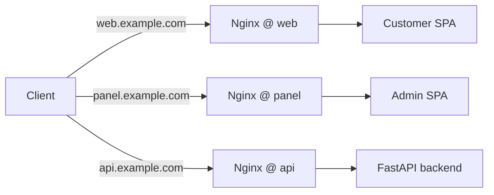

# Architecture Options — Dual SPAs and API on Nginx (Blue/Green)

## 1) Overview

- Current: Admin SPA is built with Vue/Vite and presently mounted at `/` (served by Nginx from `app/frontend/panel/dist`). FastAPI backend is exposed at `/api/v1/*` behind Nginx. Blue/green scripts and configs exist for zero‑downtime cutovers.
- Migration goal: Move Admin SPA to `/panel`, keep API stable at `/api/v1/*`, and introduce a new Customer SPA at `/` — all under the same Nginx blue/green deployment.
- High‑level requirements:
  - Customer SPA at `/`
  - Admin SPA at `/panel`
  - API stable at `/api/v1/*`
  - Blue/green cutovers with pre‑switch health checks and smoke tests

## 2) Option A — Dual SPA on Same Origin (Preferred MVP)

Nginx serves both SPAs on a single domain:
- `/` → Customer SPA `dist`
- `/panel` → Admin SPA `dist`
- `/api/v1/*` → FastAPI upstream (blue/green ports)

```mermaid
flowchart LR
  client[Client] --> nginx[Nginx (blue/green)]
  nginx -->|"/"| webSPA[Customer SPA (web/dist)]
  nginx -->|"/panel/*"| adminSPA[Admin SPA (panel/dist)]
  nginx -->|"/api/v1/*"| api[FastAPI backend (8001/8002)]
  nginx -->|"/admin/*"| redirect[301 → /panel/*]
  redirect --> adminSPA
```

Pros
- Simple mental model; single origin avoids CORS/CSRF complexity.
- Shared TLS, headers, and logging; easy blue/green switch.
- Straightforward caching policy (immutable assets; short TTL HTML).

Cons
- Risk of SPA asset mixups if bases not set correctly (router/Vite base).
- Slightly busier Nginx config; need precise history fallback per base.

Rollout (non‑breaking)
- Add `/panel` block and `/admin/* → /panel/*` redirect.
- Set router base and Vite base for Admin SPA; rebuild and deploy.
- Introduce Customer SPA at `/` when ready; preserve history fallback.
- Smoke check: `/`, `/panel/`, `/api/v1/health` before switching traffic.

## 3) Option B — Subdomain Split

- `web.example.com` → Customer SPA
- `panel.example.com` → Admin SPA
- `api.example.com` → API



Pros
- Clear separation of concerns; easier per‑site CDN caching and rules.
- Lower chance of asset/base path collisions; distinct operational blast radii.

Cons
- Introduces cross‑origin concerns: CORS, cookies (SameSite/Domain), CSRF.
- More certificates/DNS/monitoring; more deploy coordination.

Why not for MVP
- Adds auth/CORS complexity and infra overhead without immediate UX gain.

## 4) Option C — Single SPA with Protected Admin Shell

- A unified SPA provides both public and admin shells; admin routes protected behind auth/roles.

Pros
- DRY shared components/state; one build and deployment.

Cons
- Tighter coupling; larger bundle; stricter auth/hardening needed.
- Higher migration effort from current separate‑SPA direction.

Why not for MVP
- Increases risks and timeline; less modular for staggered releases.

## 5) Cross‑Cutting Concerns

- Redirects: Permanent `/admin/* → /panel/*` with path+query preserved to avoid broken bookmarks.
- History fallback: `try_files ... /index.html` for `/` and `/panel/index.html` for the admin base.
- Cache headers: HTML short TTL (revalidate), static assets immutable and long‑lived.
- Blue/green: Two directories/ports; verify health (`/api/v1/health`) and basic SPA loads (`/`, `/panel/`) before swapping.
- Observability: Log SPA 404s (missing chunks), track navigation errors, synthetic checks for deep links.
- Security: Rate‑limit public POST endpoints (login/search/leads); JWT remains for admin; audit CSP for analytics.

## 6) Recommendation (non‑binding)

- Choose Option A for MVP: dual SPAs on the same origin. It delivers the clean `/` vs `/panel` separation with minimal operational overhead and no new CORS surface.
- Assumptions: Admin SPA sets router base and Vite base to `/panel/`; Nginx adds dedicated blocks with correct fallbacks; blue/green swap remains the mechanism for zero‑downtime deploys.
- Keep the door open for Option B later if independent scaling/caching or organizational separation becomes necessary.

## 7) Open Questions

- SEO and analytics: What are the SEO/i18n requirements for the Customer SPA at `/` and which analytics providers/scripts must be allowed in CSP?
- CDN fronting: Will Cloudflare/CDN sit in front of Nginx? If so, what cache/purge strategy and headers should we adopt (HTML vs assets)?
- TLS termination: Terminate at CDN, Nginx, or both? Any mTLS or client‑cert needs for admin/API?
- Cache purge: What is the canonical purge trigger on release (artifact hash, webhook), and do we need versioned asset paths beyond content hashing?
- Monitoring: Which synthetic checks (paths/deep links) and dashboards are required for blue/green smoke and steady‑state?
- Auth boundaries: Any cross‑origin requirements in the near term (that would favor Option B) or can we enforce same‑origin strictly for MVP?

