# Chinese Auto Parts Price Bot - Wizard Flow Design

## 1. Purpose & Philosophy

### Current Challenge
The existing free-text query approach, while flexible, often leads to:
- **Information gaps**: Users don't provide complete vehicle details
- **Mismatched results**: Vague queries return irrelevant parts
- **Lost opportunities**: Poor queries result in no matches, losing potential customers
- **Inconsistent data**: Unstructured input makes lead qualification difficult

### Wizard Flow Benefits
A step-by-step wizard approach addresses these issues by:
- **Guided information gathering**: Ensures all critical details are captured
- **Higher match accuracy**: Structured data enables precise part identification
- **Better lead quality**: Complete customer and vehicle profiles
- **Reduced support burden**: Clear process minimizes user confusion
- **Data consistency**: Structured input improves search and analytics

### Design Principles
- **Natural conversation**: Persian language, conversational tone
- **Progressive disclosure**: Ask only what's needed at each step
- **Flexible completion**: Allow users to skip optional steps
- **Confirmation loops**: Validate understanding before proceeding
- **Graceful fallback**: Handle incomplete or incorrect information

## 2. Wizard Flow Architecture

### Core Flow Structure
```
Start → Vehicle Identification → Part Identification → Confirmation → Contact Capture → Order Creation
```

### Alternative Flow Patterns

#### Pattern A: Vehicle-First Approach (Recommended)
1. **Brand Selection** → 2. **Model Selection** → 3. **Year/Trim** → 4. **Part Category** → 5. **Specific Part** → 6. **Confirmation** → 7. **Contact**

#### Pattern B: Part-First Approach
1. **Part Category** → 2. **Brand Selection** → 3. **Model Selection** → 4. **Year/Trim** → 5. **Specific Part** → 6. **Confirmation** → 7. **Contact**

#### Pattern C: Hybrid Approach
1. **Initial Query Analysis** → 2. **Missing Information Collection** → 3. **Confirmation** → 4. **Contact**

## 3. Detailed Wizard Flow Design

### 3.1 Vehicle-First Flow (Primary Recommendation)

#### Step 1: Brand Selection
**Bot Message:**
```
خوش آمدید! برای یافتن قطعات خودرو، ابتدا برند خودرو خود را انتخاب کنید:

🚗 برند خودرو:
/چری /جک /بریلیانس /مزدا /هیوندای /کیا /دیگر
```

**User Interaction:**
- Inline keyboard with brand options
- Custom input option for other brands
- Validation against supported brands

**Data Captured:**
- `vehicle_make` (standardized)
- Brand confidence score

#### Step 2: Model Selection
**Bot Message:**
```
عالی! برند چری انتخاب شد. حالا مدل خودرو خود را مشخص کنید:

🚙 مدل چری:
/تیگو8 /تیگو7 /تیگو5 /آریزو5 /آریزو6 /دیگر
```

**User Interaction:**
- Dynamic model list based on brand
- Search functionality for long lists
- "Other" option with text input

**Data Captured:**
- `vehicle_model` (standardized)
- Model year range (if applicable)

#### Step 3: Year and Trim (Optional)
**Bot Message:**
```
مدل تیگو ۸ انتخاب شد. برای دقت بیشتر، سال ساخت و نوع خودرو را مشخص کنید:

📅 سال ساخت: [Inline keyboard: 2020-2024]
🎯 نوع: /پرو /اسپورت /پلاس /سفارشی
```

**User Interaction:**
- Year range selection
- Trim/variant options
- Skip option available

**Data Captured:**
- `model_year_from` / `model_year_to`
- `vehicle_trim`

#### Step 4: Part Category Selection
**Bot Message:**
```
بسیار خوب! تیگو ۸ سال ۲۰۲۲ پرو.
حالا نوع قطعه مورد نیاز خود را انتخاب کنید:

🔧 دسته‌بندی قطعات:
/سیستم_ترمز /موتور /تعلیق /برق /بدنه /دیگر
```

**User Interaction:**
- Category icons and Persian names
- Subcategory drill-down
- Custom category input

**Data Captured:**
- `category` (primary)
- `subcategory` (if applicable)

#### Step 5: Specific Part Identification
**Bot Message:**
```
سیستم ترمز انتخاب شد. قطعه دقیق مورد نیاز:

🛑 قطعات ترمز:
/لنت_جلو /لنت_عقب /دیسک_جلو /دیسک_عقب /کالیپر /دیگر

یا توضیح دقیق‌تری بنویسید:
```

**User Interaction:**
- Specific part options
- Text input for custom parts
- Position specification (front/rear/left/right)

**Data Captured:**
- `part_name`
- `position`
- `query_text` (original user input)

#### Step 6: Confirmation and Search
**Bot Message:**
```
خلاصه درخواست شما:
🚗 خودرو: چری تیگو ۸ پرو (۲۰۲۲)
🛑 قطعه: لنت ترمز جلو
🔍 جستجو در حال انجام...

✅ آیا این اطلاعات صحیح است؟
```

**User Interaction:**
- Confirmation buttons (Yes/No/Edit)
- Search results display
- Multiple match options

**Data Captured:**
- User confirmation
- Selected part details
- Search confidence score

#### Step 7: Contact Capture
**Bot Message:**
```
قطعه مورد نظر یافت شد! برای تکمیل سفارش:

📞 شماره تماس خود را ارسال کنید
📍 شهر محل سکونت (اختیاری)

[Share Contact Button]
```

**User Interaction:**
- Contact sharing via Telegram
- Optional location input
- Order summary confirmation

**Data Captured:**
- `phone_e164`
- `first_name` / `last_name`
- `city`
- `consent`

### 3.2 Alternative Flow Patterns

#### Pattern B: Part-First Approach
```
Start → Part Category → Brand → Model → Year/Trim → Specific Part → Confirmation → Contact
```

**Use Case:** When users know the part type but are unsure about vehicle details.

**Advantages:**
- Faster for experienced users
- Better for generic parts
- Reduces vehicle complexity upfront

#### Pattern C: Hybrid Approach
```
Start → Initial Query → Missing Info Collection → Confirmation → Contact
```

**Use Case:** For users who provide partial information in their first message.

**Advantages:**
- Respects user's initial input
- Minimizes repetitive questions
- Flexible completion path

## 4. Implementation Considerations

### 4.1 State Management
```python
class WizardState(Enum):
    START = "start"
    BRAND_SELECTION = "brand"
    MODEL_SELECTION = "model"
    YEAR_TRIM = "year_trim"
    CATEGORY_SELECTION = "category"
    PART_SELECTION = "part"
    CONFIRMATION = "confirm"
    CONTACT_CAPTURE = "contact"
    COMPLETED = "completed"
```

### 4.2 Data Structure
```python
class WizardSession:
    user_id: str
    state: WizardState
    vehicle_data: Dict[str, Any]
    part_data: Dict[str, Any]
    contact_data: Dict[str, Any]
    created_at: datetime
    updated_at: datetime
```

### 4.3 Fallback Mechanisms
- **Incomplete data**: Allow partial completion with warnings
- **Invalid selections**: Provide correction options
- **Timeout handling**: Resume from last completed step
- **Error recovery**: Graceful degradation to free-text search

## 5. User Experience Enhancements

### 5.1 Conversation Flow

```mermaid
sequenceDiagram
    participant U as User
    participant BOT as Bot
    participant API as FastAPI
    participant DB as Database
    
    U->>BOT: /start
    BOT->>U: "برند خودرو را انتخاب کنید"
    
    U->>BOT: /چری
    BOT->>API: GET /parts/brands/چری/models
    API->>DB: SELECT DISTINCT vehicle_model FROM parts WHERE brand_oem = 'Chery'
    DB-->>API: Models list
    API-->>BOT: Available models
    BOT->>U: "مدل چری را انتخاب کنید"
    
    U->>BOT: /تیگو8
    BOT->>API: GET /parts/categories?brand=چری&model=تیگو8
    API->>DB: SELECT DISTINCT category FROM parts WHERE vehicle_model = 'Tiggo 8'
    DB-->>API: Categories
    API-->>BOT: Available categories
    BOT->>U: "نوع قطعه را انتخاب کنید"
    
    U->>BOT: /سیستم_ترمز
    BOT->>API: GET /parts/search?brand=چری&model=تیگو8&category=Brake System
    API->>DB: SELECT * FROM parts WHERE vehicle_model = 'Tiggo 8' AND category = 'Brake System'
    DB-->>API: Brake parts
    API-->>BOT: Specific parts
    BOT->>U: "قطعه دقیق را انتخاب کنید"
    
    U->>BOT: /لنت_جلو
    BOT->>U: "خلاصه: چری تیگو ۸ - لنت ترمز جلو. آیا صحیح است؟"
    
    U->>BOT: ✅ بله
    BOT->>U: "شماره تماس خود را ارسال کنید"
    
    U->>BOT: [Contact Share]
    BOT->>API: POST /orders (create order)
    API->>DB: INSERT INTO orders, order_items
    BOT->>U: "سفارش ثبت شد! شماره سفارش: #ORD-12345"
```


### 5.2 Smart Suggestions
- **Recent searches**: Show user's previous queries
- **Popular combinations**: Highlight frequently searched parts
- **Alternative suggestions**: Offer related or compatible parts
- **Price indicators**: Show availability status (without prices)

### 5.3 Error Handling
- **Invalid input**: Clear error messages with examples
- **No matches**: Suggest alternatives or broader categories
- **Technical errors**: Graceful fallback to basic search
- **Timeout recovery**: Resume from last completed step

## 6. Technical Implementation

### 6.1 Bot State Machine
```python
from aiogram.fsm.state import State, StatesGroup

class PartsWizard(StatesGroup):
    waiting_for_brand = State()
    waiting_for_model = State()
    waiting_for_year_trim = State()
    waiting_for_category = State()
    waiting_for_part = State()
    waiting_for_confirmation = State()
    waiting_for_contact = State()
```

### 6.2 Data Validation
```python
class VehicleData(BaseModel):
    brand: str
    model: str
    year: Optional[int] = None
    trim: Optional[str] = None
    
class PartData(BaseModel):
    category: str
    subcategory: Optional[str] = None
    part_name: str
    position: Optional[str] = None
```

### 6.3 API Endpoints
```python
# New wizard-specific endpoints
GET /api/v1/wizard/brands
GET /api/v1/wizard/models/{brand}
GET /api/v1/wizard/categories/{brand}/{model}
GET /api/v1/wizard/parts/{brand}/{model}/{category}
POST /api/v1/wizard/validate-session
```

## 7. Flexibility and Variations

### 7.1 Quick Access Options
- **Expert mode**: Skip to part selection for experienced users
- **Bulk mode**: Handle multiple parts in one wizard session
- **Template mode**: Save common vehicle/part combinations

### 7.2 Adaptive Flow
- **User behavior learning**: Adjust flow based on user patterns
- **Context awareness**: Remember previous searches
- **Progressive enhancement**: Start simple, add complexity as needed

### 7.3 Multi-language Support
- **Persian primary**: All user-facing text in Persian
- **English fallback**: Technical terms in English when needed
- **RTL support**: Proper right-to-left text handling

## 8. Benefits Analysis

### 8.1 For Users
- **Clear guidance**: Step-by-step process eliminates confusion
- **Higher success rate**: Structured input leads to better matches
- **Faster completion**: Guided process is more efficient
- **Better experience**: Professional, organized interaction

### 8.2 For Business
- **Better lead quality**: Complete customer and vehicle profiles
- **Reduced support**: Fewer unclear or incomplete requests
- **Improved conversion**: Higher match rates lead to more orders
- **Data consistency**: Structured data improves analytics

### 8.3 For System
- **Better search results**: Structured queries improve matching
- **Reduced ambiguity**: Clear data reduces interpretation errors
- **Scalable architecture**: Wizard pattern supports future enhancements
- **Maintainable code**: Clear state management and flow control

## 9. Implementation Phases

### Phase 1: Core Wizard Flow
- Implement basic vehicle-first flow
- Add state management and persistence
- Create wizard-specific API endpoints
- Basic error handling and validation

### Phase 2: Enhanced UX
- Add smart suggestions and recent searches
- Implement alternative flow patterns
- Add bulk part handling
- Improve error messages and recovery

### Phase 3: Advanced Features
- Add user behavior learning
- Implement template system
- Add multi-language support
- Performance optimization

### Phase 4: Analytics and Optimization
- Add wizard completion analytics
- A/B testing for flow variations
- User feedback collection
- Continuous improvement based on data

## 10. Success Metrics

### 10.1 User Experience Metrics
- **Completion rate**: Percentage of users who complete the wizard
- **Time to completion**: Average time from start to order creation
- **Error rate**: Percentage of users who encounter errors
- **User satisfaction**: Feedback scores and comments

### 10.2 Business Metrics
- **Lead quality score**: Completeness and accuracy of captured data
- **Conversion rate**: Wizard completions that become orders
- **Support ticket reduction**: Fewer unclear or incomplete requests
- **Data consistency**: Improved search and matching accuracy

### 10.3 Technical Metrics
- **Search accuracy**: Percentage of successful part matches
- **Response time**: Wizard step processing speed
- **Error recovery**: Successful fallback to alternative flows
- **System reliability**: Uptime and error rates

## 11. Next Steps

### 11.1 Immediate Actions
1. **Flow Validation**: Review and refine the proposed wizard steps
2. **User Testing**: Validate flow with target users (mechanics, sellers, customers)
3. **Technical Design**: Finalize state management and API design
4. **UI/UX Design**: Create wireframes and conversation flows

### 11.2 Development Preparation
1. **State Machine Implementation**: Build the core wizard state management
2. **API Development**: Create wizard-specific endpoints
3. **Database Updates**: Add wizard session storage
4. **Bot Integration**: Integrate wizard flow with existing bot

### 11.3 Testing and Validation
1. **Unit Testing**: Test individual wizard steps and transitions
2. **Integration Testing**: Test complete wizard flows
3. **User Acceptance Testing**: Validate with real users
4. **Performance Testing**: Ensure wizard performs under load

### 11.4 Deployment and Monitoring
1. **Gradual Rollout**: Deploy wizard as optional flow initially
2. **A/B Testing**: Compare wizard vs. free-text approaches
3. **Analytics Setup**: Monitor wizard performance and user behavior
4. **Continuous Improvement**: Iterate based on user feedback and data

---

## Conclusion

The wizard flow approach represents a significant improvement over the current free-text query system. By guiding users through structured information collection, we can:

- **Improve user experience** through clear, step-by-step guidance
- **Increase conversion rates** by ensuring complete and accurate data
- **Reduce support burden** through better data quality and user clarity
- **Enable better analytics** through structured, consistent data collection

The proposed vehicle-first flow provides a natural, logical progression that matches how users think about their car parts needs. The flexibility to handle different user types and scenarios ensures the wizard can adapt to various use cases while maintaining the core benefits of structured data collection.

**The key to success will be balancing structure with flexibility, ensuring the wizard feels helpful rather than restrictive, and providing clear value at each step of the process.**

---

*Document Version: 1.0*  
*Last Updated: 2024-01-19*  
*Status: Draft - Awaiting Review and Validation*
